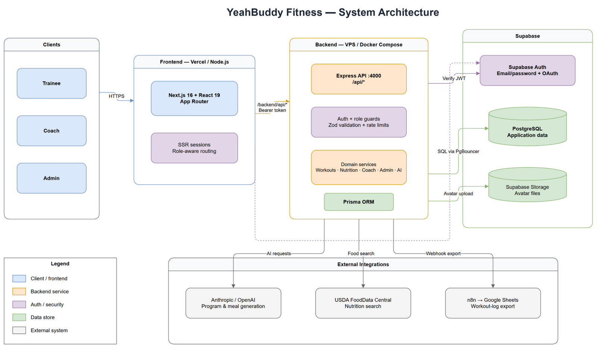

# YeahBuddy Fitness

> An open-source full-stack fitness platform for trainees, coaches, and small coaching teams.

YeahBuddy helps trainees log workouts, track nutrition, monitor body metrics, follow coach-assigned programs, and review progress in one place. Coaches can build training programs, assign them to clients, review workout logs, leave feedback, and manage check-ins.

The app is built as a monorepo:

- **Frontend:** Next.js 16 App Router, React 19, TypeScript, Tailwind CSS v4, shadcn/ui
- **Backend:** Express 4, TypeScript, Prisma 6
- **Database/Auth:** PostgreSQL and Supabase Auth
- **AI features:** optional Anthropic or OpenAI provider for workout and meal-plan generation

UI copy is localized for Vietnamese and English.

---

## Contents

- [Features](#features)
- [Screens and Roles](#screens-and-roles)
- [Tech Stack](#tech-stack)
- [Architecture](#architecture)
- [System Diagrams](#system-diagrams)
- [Repository Structure](#repository-structure)
- [Getting Started](#getting-started)
- [Environment Variables](#environment-variables)
- [Database Setup](#database-setup)
- [Useful Scripts](#useful-scripts)
- [Testing and Quality](#testing-and-quality)
- [API Overview](#api-overview)
- [Project Conventions](#project-conventions)
- [Deployment Notes](#deployment-notes)
- [Contributing](#contributing)
- [Security](#security)
- [Third-party Assets](#third-party-assets)
- [License](#license)

---

## Features

### For Trainees

- Log workouts with sets, reps, weight, RIR, completion state, and notes
- Follow coach-assigned programs or create personal routines
- View weekly schedule and today's workout
- Track workout history, volume, streaks, frequency, and PRs
- Log meals and food items with calories and macros
- Track weight and body measurements
- Generate workout programs and meal plans with an optional AI provider
- Discover coaches and request coaching

### For Coaches

- Create, edit, archive, and assign training programs
- Build workouts with ordered exercises and target sets
- Monitor trainee compliance and weekly activity
- Review trainee logs, body metrics, check-ins, and recent PRs
- Comment on workout logs
- Import programs from Google Sheets or Notion when configured
- Manage a coach-owned exercise library

### For Admins

- Manage users, roles, and active state
- Review coach requests and coach-trainee connections
- Curate global exercise and food data
- Inspect platform metrics and audit logs

### Cross-cutting

- Supabase email/password and OAuth auth flow
- Cookie-based SSR sessions through `@supabase/ssr`
- Server-side role enforcement
- Consistent API error envelope
- Structured backend logging
- Rate limits for authenticated and AI-heavy routes
- Excel-style export helpers and optional n8n webhook export

---

## Screens and Roles

| Role | Default Area | Main Capabilities |
|---|---|---|
| `trainee` | `/dashboard` | Training, meals, progress, schedule, AI generation, coach discovery |
| `coach` | `/coach` | Programs, assignments, trainee monitoring, check-ins, workout feedback |
| `admin` | `/admin` | Platform operations, users, library curation, audit logs |

Public users land on `/` and can open the auth modal. After login, the app redirects users to the correct role area.

---

## Tech Stack

### Frontend

- Next.js 16 with App Router
- React 19
- TypeScript 5
- Tailwind CSS v4
- shadcn/ui and Radix UI primitives
- Recharts
- TanStack Query
- `@supabase/ssr`
- `lucide-react`

### Backend

- Node.js
- Express 4
- TypeScript
- Prisma 6
- PostgreSQL
- Supabase Auth and Storage
- Zod validation
- Vitest

### Optional Integrations

- Anthropic or OpenAI for AI workout and meal-plan generation
- Google OAuth, Google Sheets, and Drive APIs for program imports
- Notion API for program imports
- n8n webhook for workout-log export

---

## Architecture



At a high level:

1. The browser uses the Next.js frontend.
2. Frontend requests to `/backend/api/*` are rewritten to the Express backend.
3. The frontend sends the Supabase access token with authenticated API calls.
4. The backend verifies the token, syncs the local profile, enforces role access, and runs business logic.
5. Prisma reads and writes application data in PostgreSQL.
6. Optional AI and import/export providers are called only by the backend.

Editable diagrams are available in:

- [`docs/architecture.drawio`](docs/architecture.drawio)
- [`docs/use-cases.drawio`](docs/use-cases.drawio)
- [`docs/sequence-diagrams.drawio`](docs/sequence-diagrams.drawio)
- [`docs/erd-system/README.md`](docs/erd-system/README.md)

## System Diagrams

Archify diagrams are available as standalone interactive HTML files with pan, zoom, view focus, and export controls:

| Diagram | HTML | Spec |
|---|---|---|
| ERD overview | [`docs/archify/erd.html`](docs/archify/erd.html) | [`docs/archify/erd.architecture.json`](docs/archify/erd.architecture.json) |
| Class and module overview | [`docs/archify/class.html`](docs/archify/class.html) | [`docs/archify/class.architecture.json`](docs/archify/class.architecture.json) |
| Use case map | [`docs/archify/use-case.html`](docs/archify/use-case.html) | [`docs/archify/use-case.workflow.json`](docs/archify/use-case.workflow.json) |
| Core request sequence | [`docs/archify/sequence.html`](docs/archify/sequence.html) | [`docs/archify/sequence.sequence.json`](docs/archify/sequence.sequence.json) |

The Archify source specs are validated with the `showcase` quality profile before the HTML artifacts are generated.

---

## Repository Structure

```text
.
├── app/                         # Next.js App Router pages and layouts
│   ├── (shell)/                 # Authenticated app shell
│   ├── auth/callback/           # Supabase OAuth/email callback
│   ├── reset-password/          # Password reset flow
│   └── page.tsx                 # Public landing page
├── components/                  # Feature UI and shadcn/ui primitives
├── lib/                         # Frontend API clients, auth, i18n, types
├── public/                      # Static assets
├── docs/                        # Architecture, ERD, sequence, and use-case docs
├── backend/
│   ├── prisma/                  # Canonical Prisma schema and migrations
│   ├── src/
│   │   ├── config/              # Environment parsing
│   │   ├── lib/                 # Prisma, Supabase, AI, provider utilities
│   │   ├── middleware/          # Error handler, validation, rate limits
│   │   ├── routes/              # Express routers
│   │   ├── services/            # Business logic
│   │   └── scripts/             # Seed/admin/helper scripts
│   ├── Dockerfile
│   └── package.json
├── docker-compose.yml           # Backend production-style service
├── next.config.mjs              # Frontend config and backend rewrite
├── package.json                 # Frontend/root scripts
└── README.md
```

> Note: `backend/prisma/` is the canonical Prisma folder. Do not create new migrations in the root-level `prisma/` folder if one exists in your checkout.

---

## Getting Started

### Prerequisites

- Node.js 22 recommended
- npm
- A Supabase project with Auth and PostgreSQL enabled
- Optional: Anthropic or OpenAI key for AI features

### 1. Clone the Repository

```bash
git clone https://github.com/hominhduc-dev/fitness-webapp-platform.git
cd fitness-webapp-platform
```

### 2. Install Dependencies

```bash
npm install
npm install --prefix backend
```

### 3. Create Environment Files

```bash
cp .env.local.example .env.local
cp backend/.env.example backend/.env
```

Fill in the Supabase and database values described below.

### 4. Generate Prisma Client

```bash
npm run prisma:generate
```

### 5. Apply Database Migrations

For a new local/dev database:

```bash
npm run prisma:migrate
```

For production or CI deploys:

```bash
npm run prisma:deploy
```

### 6. Seed Optional Reference Data

```bash
npm run seed:exercises
npm run seed:foods
```

### 7. Start the Apps

Open two terminals:

```bash
npm run dev
```

```bash
npm run dev:backend
```

Then visit [http://localhost:3000](http://localhost:3000).

---

## Environment Variables

### Frontend: `.env.local`

```bash
NEXT_PUBLIC_APP_URL=http://localhost:3000
NEXT_PUBLIC_API_URL=http://localhost:4000
NEXT_PUBLIC_SUPABASE_URL=https://YOUR_PROJECT_REF.supabase.co
NEXT_PUBLIC_SUPABASE_PUBLISHABLE_KEY=your-anon-or-publishable-key
```

### Backend: `backend/.env`

Required for the core app:

```bash
PORT=4000
FRONTEND_URL=http://localhost:3000

DATABASE_URL=postgresql://...
DIRECT_URL=postgresql://...

SUPABASE_URL=https://YOUR_PROJECT_REF.supabase.co
SUPABASE_ANON_KEY=your-anon-or-publishable-key
SUPABASE_SERVICE_ROLE_KEY=your-service-role-key
```

Optional integrations:

```bash
# AI generation
AI_PROVIDER=anthropic
AI_MODEL=claude-haiku-4-5-20251001
ANTHROPIC_API_KEY=
OPENAI_API_KEY=
AI_API_KEY=
AI_BASE_URL=
AI_JSON_MODE=true

# n8n workout-log export
N8N_LOGS_WEBHOOK_URL=

# Notion program import
NOTION_TOKEN=
NOTION_PROGRAM_DB_ID=
NOTION_PROGRAM_ROWS_DB_ID=
NOTION_API_VERSION=2022-06-28
NOTION_TIMEOUT_MS=15000

# Google Sheets program import
GOOGLE_OAUTH_CLIENT_ID=
GOOGLE_OAUTH_CLIENT_SECRET=
GOOGLE_OAUTH_REDIRECT_URI=http://localhost:3000/backend/api/coach/google/callback
GOOGLE_TOKEN_ENCRYPTION_KEY=
```

Never expose or commit `SUPABASE_SERVICE_ROLE_KEY`, database URLs, OAuth secrets, or AI API keys.

---

## Database Setup

This project uses Prisma migrations under `backend/prisma/migrations`.

Common commands:

```bash
npm run prisma:generate   # Generate Prisma Client
npm run prisma:migrate    # Create/apply migrations in development
npm run prisma:deploy     # Apply existing migrations in production/CI
npm run prisma:studio     # Open Prisma Studio
```

For Supabase, use:

- `DATABASE_URL`: pooled connection, usually PgBouncer on port `6543`
- `DIRECT_URL`: direct database connection, usually port `5432`, used for migrations

If the schema changes, always commit:

- `backend/prisma/schema.prisma`
- the generated migration folder under `backend/prisma/migrations`

You do not commit generated Prisma Client files from `node_modules`.

---

## Useful Scripts

### Root

| Script | Description |
|---|---|
| `npm run dev` | Start Next.js dev server on port `3000` |
| `npm run build` | Build the frontend |
| `npm run start` | Start the built frontend |
| `npm run lint` | Run ESLint |
| `npm run typecheck` | Generate Next types and run TypeScript checks |
| `npm run test` | Run Vitest tests |
| `npm run dev:backend` | Start the backend through the root script |
| `npm run build:backend` | Build the backend |
| `npm run prisma:generate` | Generate Prisma Client for backend |
| `npm run prisma:migrate` | Run Prisma migration dev |
| `npm run prisma:deploy` | Deploy Prisma migrations |
| `npm run seed:exercises` | Seed exercise data |
| `npm run seed:foods` | Seed food data |
| `npm run create:admin` | Create an admin account |

### Backend

| Script | Description |
|---|---|
| `npm --prefix backend run dev` | Start Express with `tsx watch` |
| `npm --prefix backend run build` | Compile TypeScript to `backend/dist` |
| `npm --prefix backend run start` | Run the compiled backend |
| `npm --prefix backend run typecheck` | Backend TypeScript check |
| `npm --prefix backend run test` | Backend Vitest suite |
| `npm --prefix backend run prisma:validate` | Validate Prisma schema |

---

## Testing and Quality

Recommended checks before opening a PR:

```bash
npm run lint
npm run typecheck
npm run test
npm run build
npm run build:backend
```

The backend test suite covers:

- environment parsing and production fail-fast behavior
- error envelope formatting
- request validation
- auth and registration behavior
- AI output validation
- nutrition helpers
- workout and coach-domain business logic

Tests are designed to avoid reading your real `.env` during test runs.

---

## API Overview

All backend routes are mounted under `/api`. The frontend reaches them through `/backend/api/*`.

Public-ish endpoints:

- `GET /api/health`
- `GET /api/health/database`
- `GET /api/health/supabase`
- `POST /api/auth/register`
- `POST /api/auth/login`
- `POST /api/auth/refresh`
- `POST /api/auth/forgot-password`

Authenticated trainee areas:

- `/api/dashboard`
- `/api/workouts`
- `/api/meals`
- `/api/foods`
- `/api/progress`
- `/api/exercises`
- `/api/notifications`
- `/api/ai`

Coach areas:

- `/api/coach/dashboard`
- `/api/coach/programs`
- `/api/coach/trainees`
- `/api/coach/exercises`
- `/api/coach/requests`
- `/api/coach/workout-logs/:id/comments`

Admin areas:

- `/api/admin/dashboard`
- `/api/admin/users`
- `/api/admin/connections`
- `/api/admin/programs`
- `/api/admin/exercises`
- `/api/admin/audit-logs`

Most API responses follow this shape:

```json
{
  "data": null,
  "error": null,
  "meta": null
}
```

Some legacy/auth endpoints return flatter resource payloads. New endpoints should prefer the envelope.

---

## Project Conventions

- Use Prisma for database access. Raw SQL belongs in migration files only.
- Keep database migrations in `backend/prisma/migrations`.
- Backend errors should use `AppError` or a subclass.
- 5xx errors should not expose internal details to clients.
- Frontend components use named exports where practical.
- Keep service-role keys and provider secrets server-side only.
- Commit messages follow Conventional Commits, for example `feat(workout): add weekly schedule view`.

---

## Deployment Notes

The frontend and backend can be deployed separately.

### Frontend

The frontend is a standard Next.js app. Set:

```bash
NEXT_PUBLIC_APP_URL=https://your-domain.example
NEXT_PUBLIC_API_URL=https://your-backend-domain.example
NEXT_PUBLIC_SUPABASE_URL=https://YOUR_PROJECT_REF.supabase.co
NEXT_PUBLIC_SUPABASE_PUBLISHABLE_KEY=...
```

### Backend

The repository includes a production-style Docker setup:

```bash
docker compose build backend
docker compose run --rm backend npx prisma migrate deploy
docker compose up -d backend
```

After every schema change, deploy code and Prisma migrations together. A common production failure is running migrations against the database while the backend container still uses an older generated Prisma Client.

---

## Contributing

Contributions are welcome.

Good first areas:

- UI polish and accessibility
- Vietnamese and English copy improvements
- test coverage around coach and trainee workflows
- documentation improvements
- import/export integrations
- performance improvements for Prisma queries

Suggested workflow:

1. Fork the repository.
2. Create a branch from `main`.
3. Make a focused change.
4. Run the checks in [Testing and Quality](#testing-and-quality).
5. Open a pull request with a clear description and screenshots for UI changes.

Please do not include real user data, credentials, screenshots with private data, or production `.env` values in issues or pull requests.

---

## Security

If you find a security issue, please do not open a public issue with exploit details. Contact the maintainer privately first.

Important reminders for local and production setups:

- Never commit `.env`, database URLs, API keys, or OAuth secrets.
- Never expose `SUPABASE_SERVICE_ROLE_KEY` to browser code.
- Review Supabase RLS and table access before exposing a new table through public APIs.
- Keep auth and authorization checks server-side.

---

## Third-party Assets

The body map SVG data used by `components/body/` is derived from [`react-native-body-highlighter`](https://github.com/HichamELBSI/react-native-body-highlighter), MIT licensed.

Generated files should be regenerated through the project scripts instead of edited by hand.

---

## License

No license file is included yet. If you intend to make this repository truly open source, add a `LICENSE` file before publishing. MIT is a simple default for most app templates; choose something else if you need stronger conditions.
