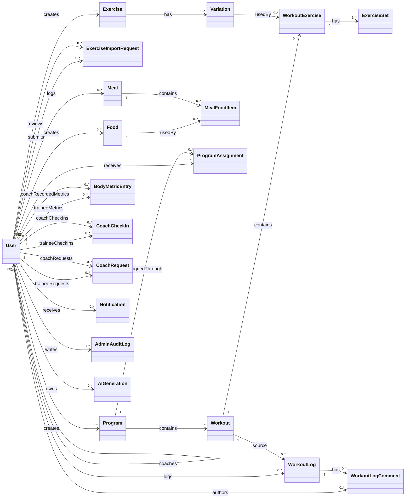
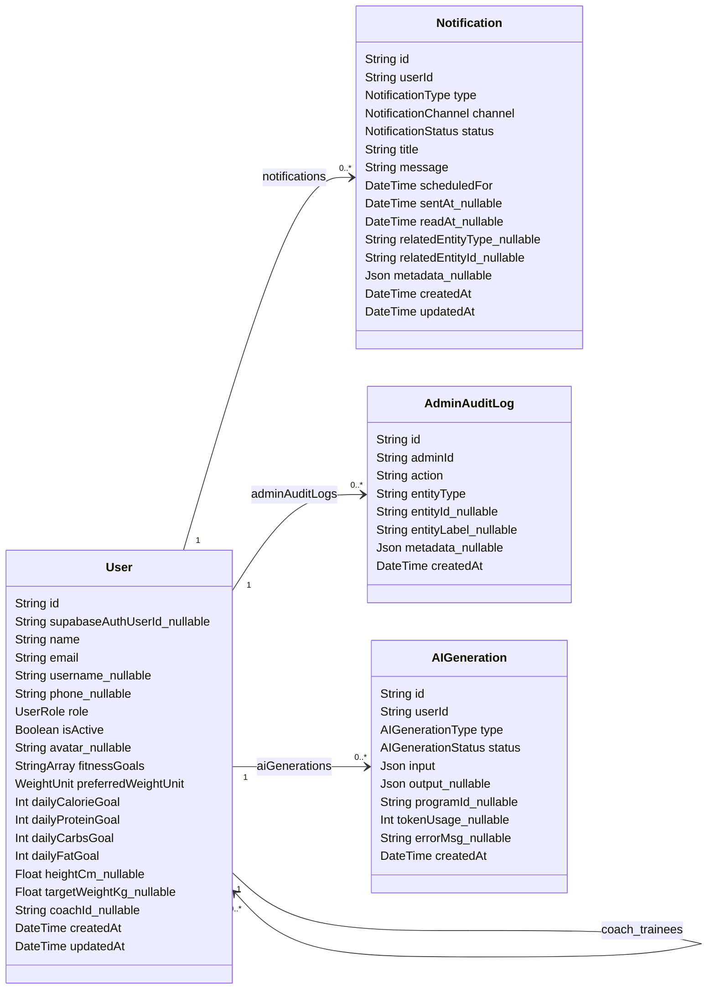
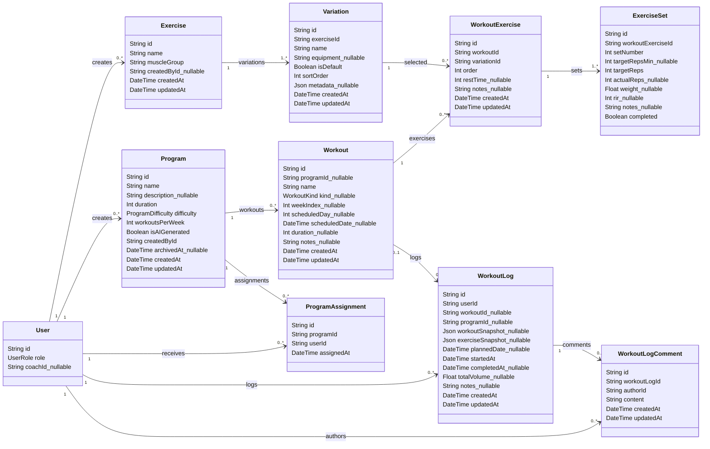
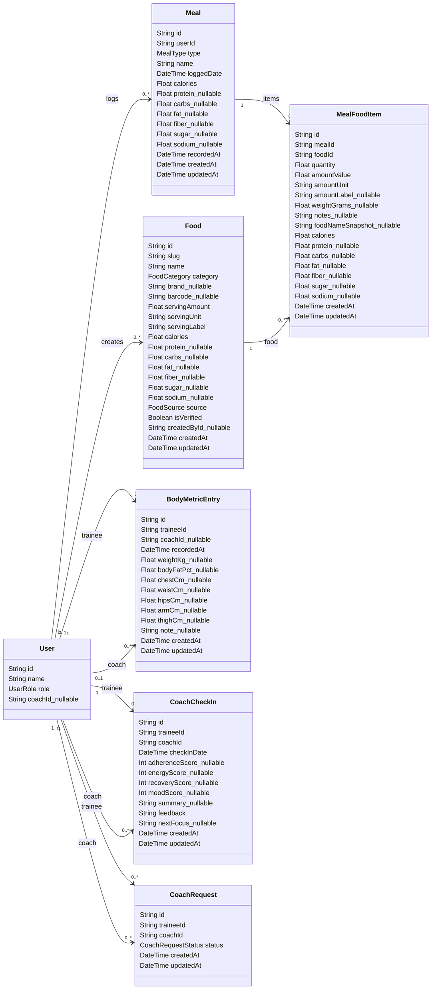
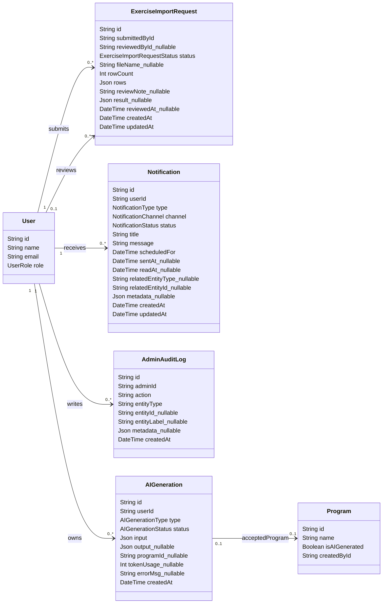

# Class Diagrams - YeahBuddy Fitness

Tài liệu này mô tả class diagram tổng quát và class diagram chi tiết của hệ thống YeahBuddy Fitness bằng Mermaid.

Nguồn đối chiếu: `backend/prisma/schema.prisma`, `README.md`, `docs/use-case-diagrams.md`, `docs/sequence-diagrams.md`.

Ghi chú:

- Sơ đồ tổng quát chỉ thể hiện lớp và quan hệ, không có phương thức và thuộc tính.
- Sơ đồ chi tiết tổng hợp ở mục 2 dùng cùng tập class và relationship với sơ đồ tổng quát, sau đó bổ sung thuộc tính chính theo Prisma model.
- Các sơ đồ chi tiết tách nhóm từ mục 3 trở đi chỉ là bản chia nhỏ để dễ render và dễ đọc hơn.
- Hệ thống hiện tại dùng data model qua Prisma, nên không mô tả method domain trong class diagram.
- Các field có hậu tố `_nullable` tương ứng field optional trong Prisma schema.
- Các field dạng `StringArray` tương ứng `String[]`.

## 1. Biểu đồ lớp tổng quát

## 2. Biểu đồ lớp chi tiết tổng hợp - dựa trên sơ đồ tổng quát

```mermaid
classDiagram
  direction LR

  class User {
    String id
    String supabaseAuthUserId_nullable
    String name
    String email
    String username_nullable
    String phone_nullable
    UserRole role
    Boolean isActive
    String avatar_nullable
    StringArray fitnessGoals
    WeightUnit preferredWeightUnit
    Int dailyCalorieGoal
    Int dailyProteinGoal
    Int dailyCarbsGoal
    Int dailyFatGoal
    Float heightCm_nullable
    Float targetWeightKg_nullable
    String coachId_nullable
    DateTime createdAt
    DateTime updatedAt
  }

  class Exercise {
    String id
    String name
    String muscleGroup
    String createdById_nullable
    DateTime createdAt
    DateTime updatedAt
  }

  class Variation {
    String id
    String exerciseId
    String name
    String equipment_nullable
    Boolean isDefault
    Int sortOrder
    Json metadata_nullable
    DateTime createdAt
    DateTime updatedAt
  }

  class ExerciseImportRequest {
    String id
    String submittedById
    String reviewedById_nullable
    ExerciseImportRequestStatus status
    String fileName_nullable
    Int rowCount
    Json rows
    String reviewNote_nullable
    Json result_nullable
    DateTime reviewedAt_nullable
    DateTime createdAt
    DateTime updatedAt
  }

  class Food {
    String id
    String slug
    String name
    FoodCategory category
    String brand_nullable
    String barcode_nullable
    Float servingAmount
    String servingUnit
    String servingLabel
    Float calories
    Float protein_nullable
    Float carbs_nullable
    Float fat_nullable
    Float fiber_nullable
    Float sugar_nullable
    Float sodium_nullable
    FoodSource source
    Boolean isVerified
    String createdById_nullable
    DateTime createdAt
    DateTime updatedAt
  }

  class Meal {
    String id
    String userId
    MealType type
    String name
    DateTime loggedDate
    Float calories
    Float protein_nullable
    Float carbs_nullable
    Float fat_nullable
    Float fiber_nullable
    Float sugar_nullable
    Float sodium_nullable
    DateTime recordedAt
    DateTime createdAt
    DateTime updatedAt
  }

  class MealFoodItem {
    String id
    String mealId
    String foodId
    Float quantity
    Float amountValue
    String amountUnit
    String amountLabel_nullable
    Float weightGrams_nullable
    String notes_nullable
    String foodNameSnapshot_nullable
    Float calories
    Float protein_nullable
    Float carbs_nullable
    Float fat_nullable
    Float fiber_nullable
    Float sugar_nullable
    Float sodium_nullable
    DateTime createdAt
    DateTime updatedAt
  }

  class Program {
    String id
    String name
    String description_nullable
    Int duration
    ProgramDifficulty difficulty
    Int workoutsPerWeek
    Boolean isAIGenerated
    String createdById
    DateTime archivedAt_nullable
    DateTime createdAt
    DateTime updatedAt
  }

  class ProgramAssignment {
    String id
    String programId
    String userId
    DateTime assignedAt
  }

  class Workout {
    String id
    String programId_nullable
    String name
    WorkoutKind kind_nullable
    Int weekIndex_nullable
    Int scheduledDay_nullable
    DateTime scheduledDate_nullable
    Int duration_nullable
    String notes_nullable
    DateTime createdAt
    DateTime updatedAt
  }

  class WorkoutExercise {
    String id
    String workoutId
    String variationId
    Int order
    Int restTime_nullable
    String notes_nullable
    DateTime createdAt
    DateTime updatedAt
  }

  class ExerciseSet {
    String id
    String workoutExerciseId
    Int setNumber
    Int targetRepsMin_nullable
    Int targetReps
    Int actualReps_nullable
    Float weight_nullable
    Int rir_nullable
    String notes_nullable
    Boolean completed
  }

  class WorkoutLog {
    String id
    String userId
    String workoutId_nullable
    String programId_nullable
    Json workoutSnapshot_nullable
    Json exerciseSnapshot_nullable
    DateTime plannedDate_nullable
    DateTime startedAt
    DateTime completedAt_nullable
    Float totalVolume_nullable
    String notes_nullable
    DateTime createdAt
    DateTime updatedAt
  }

  class WorkoutLogComment {
    String id
    String workoutLogId
    String authorId
    String content
    DateTime createdAt
    DateTime updatedAt
  }

  class BodyMetricEntry {
    String id
    String traineeId
    String coachId_nullable
    DateTime recordedAt
    Float weightKg_nullable
    Float bodyFatPct_nullable
    Float chestCm_nullable
    Float waistCm_nullable
    Float hipsCm_nullable
    Float armCm_nullable
    Float thighCm_nullable
    String note_nullable
    DateTime createdAt
    DateTime updatedAt
  }

  class CoachCheckIn {
    String id
    String traineeId
    String coachId
    DateTime checkInDate
    Int adherenceScore_nullable
    Int energyScore_nullable
    Int recoveryScore_nullable
    Int moodScore_nullable
    String summary_nullable
    String feedback
    String nextFocus_nullable
    DateTime createdAt
    DateTime updatedAt
  }

  class CoachRequest {
    String id
    String traineeId
    String coachId
    CoachRequestStatus status
    DateTime createdAt
    DateTime updatedAt
  }

  class Notification {
    String id
    String userId
    NotificationType type
    NotificationChannel channel
    NotificationStatus status
    String title
    String message
    DateTime scheduledFor
    DateTime sentAt_nullable
    DateTime readAt_nullable
    String relatedEntityType_nullable
    String relatedEntityId_nullable
    Json metadata_nullable
    DateTime createdAt
    DateTime updatedAt
  }

  class AdminAuditLog {
    String id
    String adminId
    String action
    String entityType
    String entityId_nullable
    String entityLabel_nullable
    Json metadata_nullable
    DateTime createdAt
  }

  class AIGeneration {
    String id
    String userId
    AIGenerationType type
    AIGenerationStatus status
    Json input
    Json output_nullable
    String programId_nullable
    Int tokenUsage_nullable
    String errorMsg_nullable
    DateTime createdAt
  }

  User "0..1" --> "0..*" User : coaches
  User "1" --> "0..*" Program : creates
  User "1" --> "0..*" ProgramAssignment : receives
  User "1" --> "0..*" WorkoutLog : logs
  User "1" --> "0..*" Meal : logs
  User "1" --> "0..*" Food : creates
  User "1" --> "0..*" Exercise : creates
  User "1" --> "0..*" Notification : receives
  User "1" --> "0..*" AIGeneration : owns
  User "1" --> "0..*" AdminAuditLog : writes
  User "1" --> "0..*" WorkoutLogComment : authors
  User "1" --> "0..*" ExerciseImportRequest : submits
  User "0..1" --> "0..*" ExerciseImportRequest : reviews

  Program "1" --> "0..*" Workout : contains
  Program "1" --> "0..*" ProgramAssignment : assignedThrough
  Workout "1" --> "0..*" WorkoutExercise : contains
  WorkoutExercise "1" --> "1..*" ExerciseSet : has
  Exercise "1" --> "1..*" Variation : has
  Variation "1" --> "0..*" WorkoutExercise : usedBy
  Workout "0..1" --> "0..*" WorkoutLog : source
  WorkoutLog "1" --> "0..*" WorkoutLogComment : has

  Food "1" --> "0..*" MealFoodItem : usedBy
  Meal "1" --> "0..*" MealFoodItem : contains

  User "1" --> "0..*" BodyMetricEntry : traineeMetrics
  User "0..1" --> "0..*" BodyMetricEntry : coachRecordedMetrics
  User "1" --> "0..*" CoachCheckIn : traineeCheckIns
  User "1" --> "0..*" CoachCheckIn : coachCheckIns
  User "1" --> "0..*" CoachRequest : traineeRequests
  User "1" --> "0..*" CoachRequest : coachRequests
```

## 3. Biểu đồ lớp chi tiết theo nhóm - Identity và system core

## 4. Biểu đồ lớp chi tiết theo nhóm - Training, exercise và workout log

## 5. Biểu đồ lớp chi tiết theo nhóm - Nutrition, body metrics và coaching

## 6. Biểu đồ lớp chi tiết theo nhóm - Admin, import exercise, AI và notification

## 7. Enum chi tiết

```mermaid
classDiagram
  class UserRole {
    <<enumeration>>
    trainee
    coach
    admin
  }

  class ProgramDifficulty {
    <<enumeration>>
    beginner
    intermediate
    advanced
  }

  class MealType {
    <<enumeration>>
    breakfast
    lunch
    dinner
    snack
  }

  class WorkoutKind {
    <<enumeration>>
    push
    pull
    legs
    full_body
    cardio
    other
  }

  class CoachRequestStatus {
    <<enumeration>>
    pending
    approved
    rejected
  }

  class ExerciseImportRequestStatus {
    <<enumeration>>
    pending
    approved
    rejected
  }

  class WeightUnit {
    <<enumeration>>
    kg
    lbs
  }

  class FoodSource {
    <<enumeration>>
    system
    user
  }

  class FoodCategory {
    <<enumeration>>
    staple
    protein
    veg
    fruit
    dish
    drink
    other
  }

  class AIGenerationType {
    <<enumeration>>
    workout_program
    meal_plan
  }

  class AIGenerationStatus {
    <<enumeration>>
    pending
    completed
    failed
    accepted
  }

  class NotificationType {
    <<enumeration>>
    workout_reminder
    meal_reminder
    check_in_reminder
    program_assigned
    coach_request
    workout_logged
    general
  }

  class NotificationChannel {
    <<enumeration>>
    in_app
    email
    push
  }

  class NotificationStatus {
    <<enumeration>>
    pending
    sent
    failed
    cancelled
  }
```

## 8. Traceability to 6 main use cases

Class diagram là sơ đồ cấu trúc nên vẫn bám theo Prisma model thật, không ép thành 6 nhóm use case. Bảng dưới đây chỉ map các class chính sang 6 UC để đối chiếu với use case, sequence và đặc tả.

| Use case chính | Class/model chính | Vai trò trong use case |
|---|---|---|
| UC-01 - Đăng ký tài khoản | `User` | Lưu local profile được đồng bộ từ Supabase Auth sau đăng ký. |
| UC-02 - Đăng nhập | `User`, `Notification` | `User` phục vụ session/profile/role; `Notification` là supporting flow hiển thị thông báo sau đăng nhập. |
| UC-03 - Trainee thực hiện và ghi log buổi tập | `Exercise`, `Variation`, `Program`, `ProgramAssignment`, `Workout`, `WorkoutExercise`, `ExerciseSet`, `WorkoutLog`, `WorkoutLogComment` | Mô tả workout được tạo/gán, bài tập, set target, log hoàn tất và comment liên quan log. |
| UC-04 - Trainee ghi nhận dinh dưỡng và theo dõi tiến độ | `User`, `Food`, `Meal`, `MealFoodItem`, `BodyMetricEntry`, `WorkoutLog`, `AIGeneration` | Lưu nutrition targets, food, meal log, body metrics, analytics từ workout log và AI meal plan. |
| UC-05 - Coach quản lý giáo án và trainee | `User`, `CoachRequest`, `Program`, `ProgramAssignment`, `Workout`, `WorkoutExercise`, `ExerciseSet`, `WorkoutLog`, `WorkoutLogComment`, `BodyMetricEntry`, `CoachCheckIn`, `Exercise`, `Variation`, `ExerciseImportRequest`, `Notification`, `AIGeneration` | Bao phủ kết nối coach-trainee, giáo án, theo dõi trainee, feedback, check-in, export, AI program và import request do coach gửi. |
| UC-06 - Admin quản trị hệ thống | `User`, `CoachRequest`, `Program`, `Exercise`, `Variation`, `ExerciseImportRequest`, `AdminAuditLog` | Bao phủ quản trị user/role, connection, coach request, program, exercise library, review import và audit. |

Mapping luồng phụ:

- Profile/avatar thuộc UC-02 qua class `User`.
- Resume/discard workout thuộc UC-03 nhưng lưu ở `localStorage`, không có class/database riêng.
- Notification thuộc supporting flow của UC-02/UC-03/UC-05 qua class `Notification`.
- AI meal plan thuộc UC-04; AI workout program thuộc UC-05 qua class `AIGeneration`.
- Exercise import request bắt đầu ở UC-05 qua `ExerciseImportRequest` và được admin xử lý trong UC-06.
