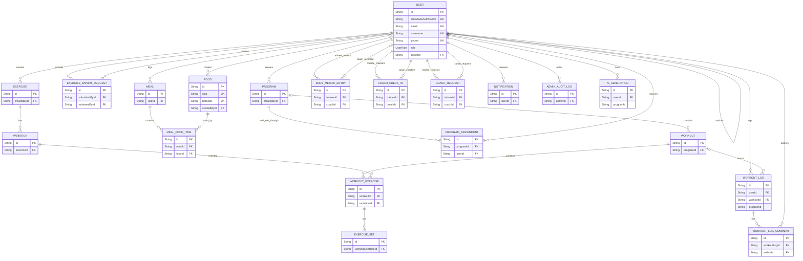
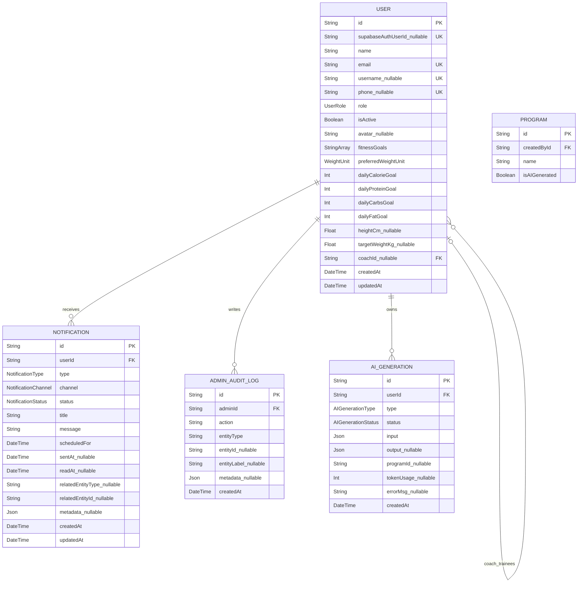
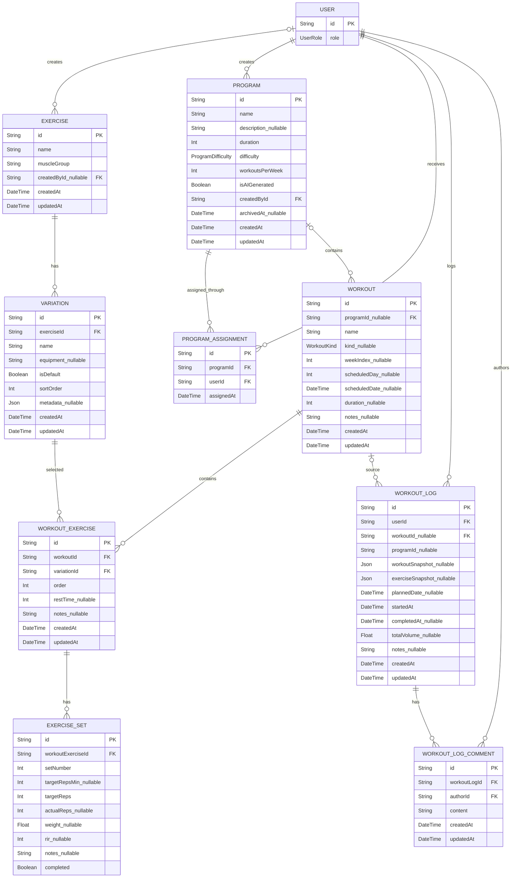
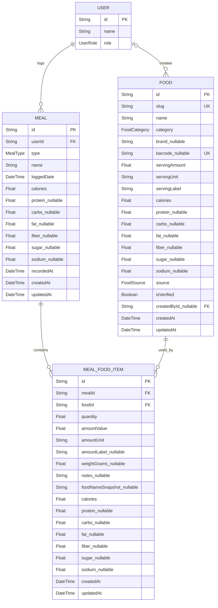
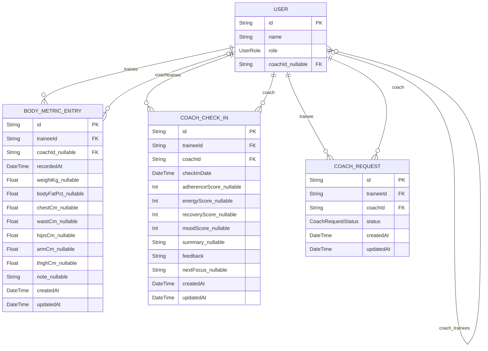
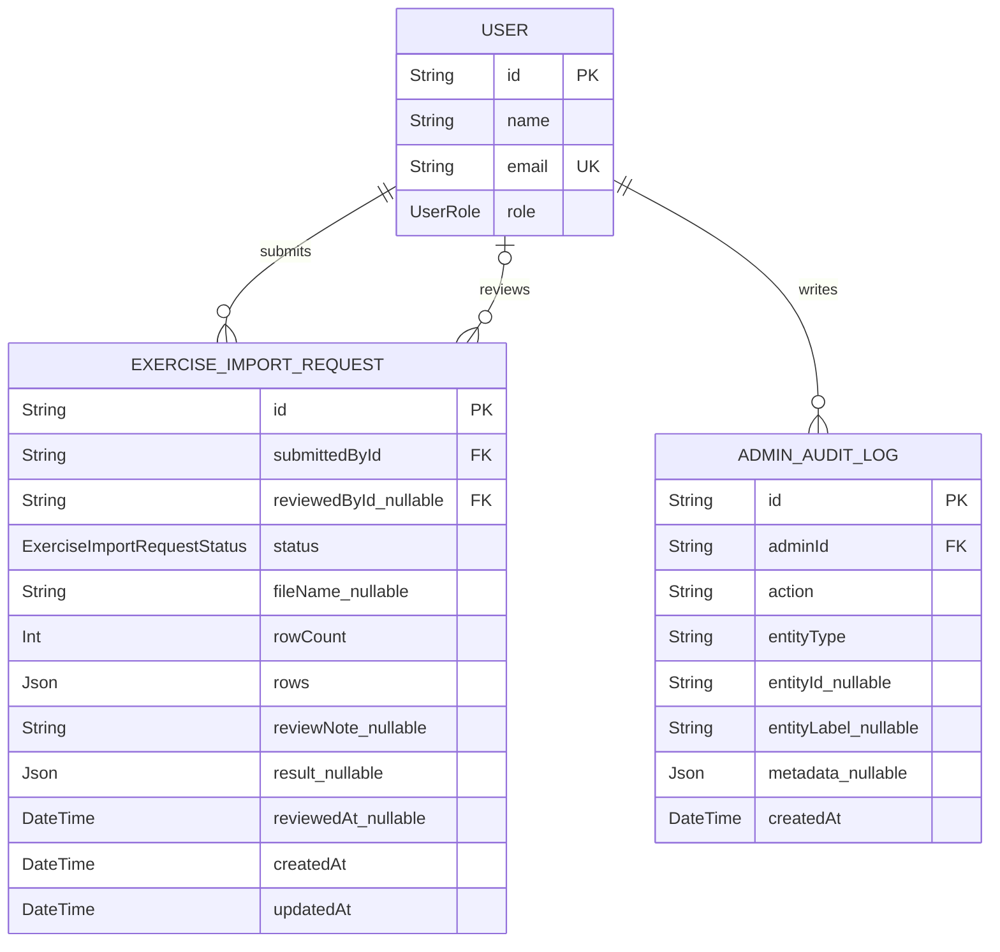

# ERD Diagrams - YeahBuddy Fitness

Tài liệu này mô tả sơ đồ thực thể - mối quan hệ (ERD) của cơ sở dữ liệu YeahBuddy Fitness bằng Mermaid `erDiagram`.

Nguồn đối chiếu: `backend/prisma/schema.prisma`.

Quy ước:

- `PK`: Primary Key.
- `FK`: Foreign Key.
- `UK`: Unique Key.
- Field có hậu tố `_nullable` là cột nullable trong Prisma schema.
- Field dạng `StringArray` tương ứng `String[]`.
- Field enum giữ nguyên tên enum trong Prisma, ví dụ `UserRole`, `MealType`, `WorkoutKind`.
- `WorkoutLog.programId` và `AIGeneration.programId` hiện là logical reference theo schema, không khai báo Prisma `@relation`, nên không đánh dấu `FK`.

Composite unique constraints không thể hiện trực tiếp trong Mermaid ERD:

- `Variation`: unique `(exerciseId, name)`.
- `ProgramAssignment`: unique `(programId, userId)`.
- `ExerciseSet`: unique `(workoutExerciseId, setNumber)`.
- `Meal`: unique `(userId, loggedDate, type)`.
- `CoachRequest`: unique `(traineeId, coachId)`.

## 1. ERD tổng quan toàn hệ thống

## 2. ERD chi tiết - Identity và platform

## 3. ERD chi tiết - Exercise, program và workout

## 4. ERD chi tiết - Nutrition

## 5. ERD chi tiết - Coaching và progress

## 6. ERD chi tiết - Admin và exercise import

## 7. Traceability to 6 main use cases

ERD là sơ đồ database nên vẫn phản ánh bảng, cột, khóa chính và khóa ngoại thật trong Prisma schema. Bảng dưới đây map entity chính sang 6 use case để đồng bộ với tài liệu use case và sequence.

| Use case chính | Entity/bảng chính | Quan hệ dữ liệu đáng chú ý |
|---|---|---|
| UC-01 - Đăng ký tài khoản | `USER` | `USER.supabaseAuthUserId` liên kết logic với Supabase Auth user; `email`, `username`, `phone` có unique constraint. |
| UC-02 - Đăng nhập | `USER`, `NOTIFICATION` | `USER.role` và `USER.isActive` quyết định phân quyền; `NOTIFICATION.userId` lưu thông báo hiển thị sau đăng nhập. |
| UC-03 - Trainee thực hiện và ghi log buổi tập | `EXERCISE`, `VARIATION`, `PROGRAM`, `PROGRAM_ASSIGNMENT`, `WORKOUT`, `WORKOUT_EXERCISE`, `EXERCISE_SET`, `WORKOUT_LOG`, `WORKOUT_LOG_COMMENT` | `WORKOUT` chứa `WORKOUT_EXERCISE`; `WORKOUT_EXERCISE` chứa `EXERCISE_SET`; `WORKOUT_LOG.userId` lưu trainee log; `WORKOUT_LOG.workoutId` là nguồn workout nullable. |
| UC-04 - Trainee ghi nhận dinh dưỡng và theo dõi tiến độ | `USER`, `FOOD`, `MEAL`, `MEAL_FOOD_ITEM`, `BODY_METRIC_ENTRY`, `WORKOUT_LOG`, `AI_GENERATION` | `MEAL` unique theo `(userId, loggedDate, type)`; `MEAL_FOOD_ITEM` nối `MEAL` và `FOOD`; `BODY_METRIC_ENTRY.traineeId` lưu progress; AI meal plan lưu ở `AI_GENERATION`. |
| UC-05 - Coach quản lý giáo án và trainee | `USER`, `COACH_REQUEST`, `PROGRAM`, `PROGRAM_ASSIGNMENT`, `WORKOUT`, `WORKOUT_LOG`, `WORKOUT_LOG_COMMENT`, `BODY_METRIC_ENTRY`, `COACH_CHECK_IN`, `EXERCISE`, `VARIATION`, `EXERCISE_IMPORT_REQUEST`, `NOTIFICATION`, `AI_GENERATION` | `USER.coachId` là quan hệ coach-trainee; `COACH_REQUEST` unique theo `(traineeId, coachId)`; `PROGRAM_ASSIGNMENT` unique theo `(programId, userId)`; coach comment/check-in/progress dùng các FK về `USER`. |
| UC-06 - Admin quản trị hệ thống | `USER`, `COACH_REQUEST`, `PROGRAM`, `EXERCISE`, `VARIATION`, `EXERCISE_IMPORT_REQUEST`, `ADMIN_AUDIT_LOG` | Admin cập nhật user/connection/request/program/exercise và ghi `ADMIN_AUDIT_LOG.adminId`; review import dùng `EXERCISE_IMPORT_REQUEST.reviewedById`. |

Ghi chú đồng bộ:

- Resume/discard workout là trạng thái client-only trong `localStorage`, không có bảng riêng trong ERD.
- Export workout logs dùng dữ liệu `WORKOUT_LOG` và tích hợp n8n/Google Sheets, không có bảng export riêng.
- Profile/avatar/nutrition targets nằm trong entity `USER`.
- `AI_GENERATION.programId` là logical reference trong schema hiện tại, không phải Prisma relation.
