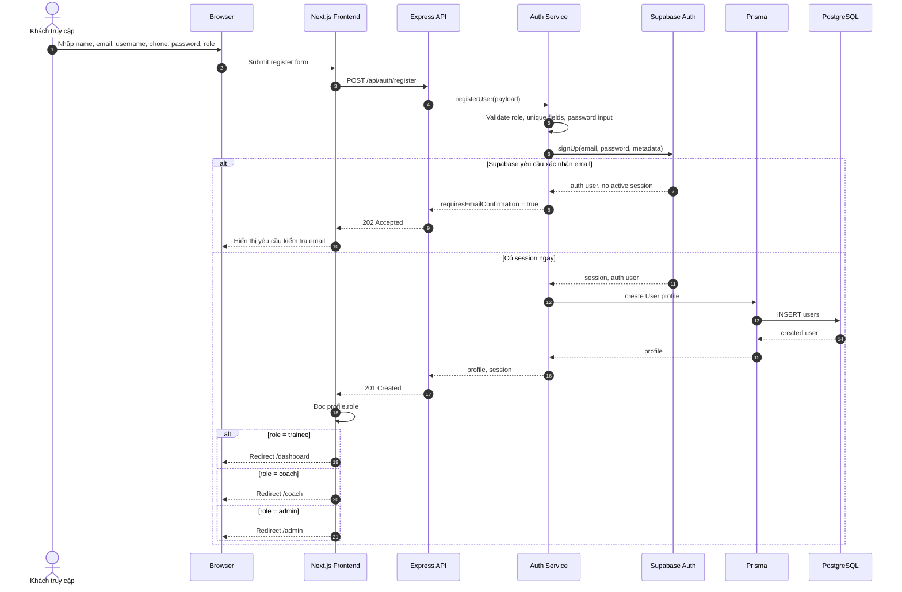
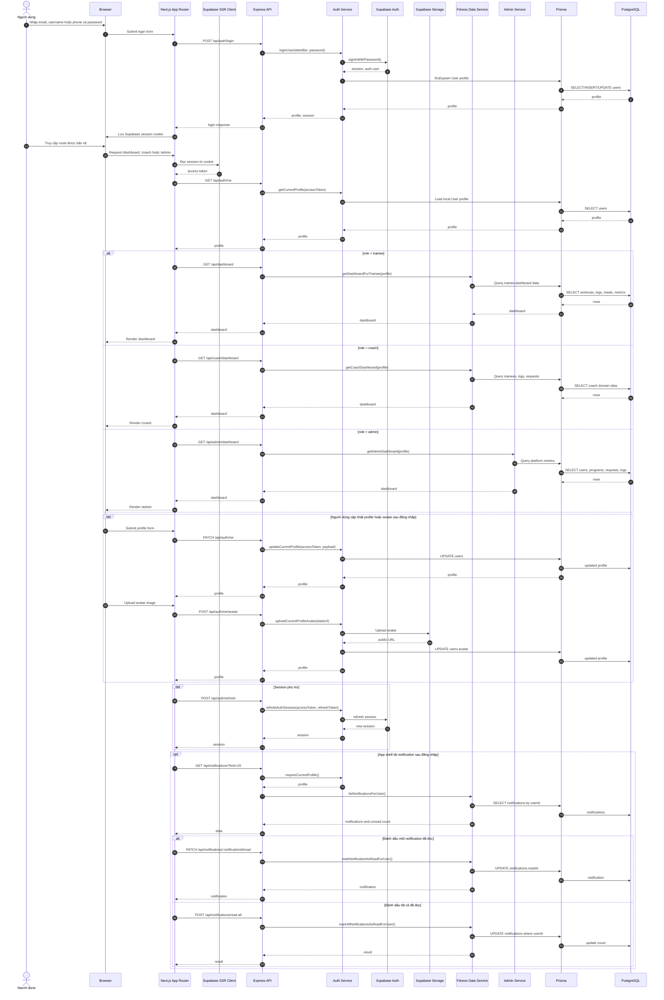
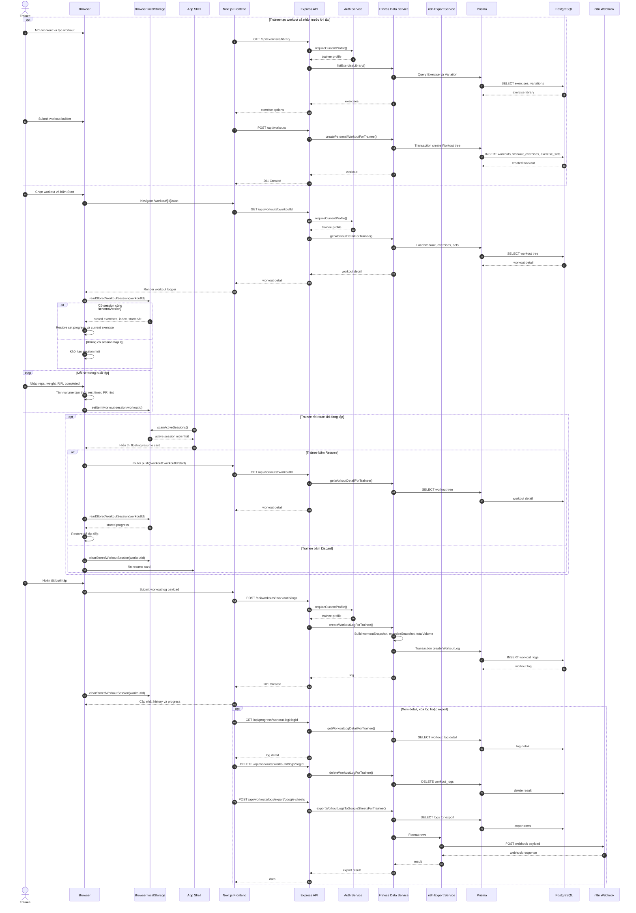
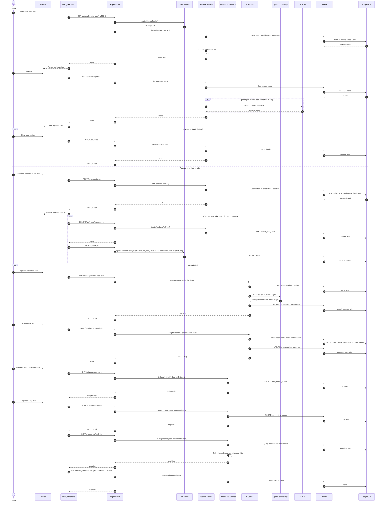

# Sequence Diagrams - YeahBuddy Fitness

Tài liệu này mô tả 6 sơ đồ tuần tự chính tương ứng 6 use case chính của hệ thống YeahBuddy Fitness bằng Mermaid `sequenceDiagram`. Các luồng profile, resume workout, notification, AI, export và exercise import được mô tả bằng `opt` / `alt` trong UC liên quan, không tách thành sequence chính riêng.

Nguồn đối chiếu: `docs/use-case-diagrams.md`, `backend/prisma/schema.prisma`, `backend/src/routes/*`, `lib/*/api.ts`.

Quy ước participant:

- `Browser`: người dùng thao tác trên UI Next.js.
- `Next.js`: App Router, client components, server components, route guards và proxy `/backend/*`.
- `Express API`: backend Express mount route dưới `/api`.
- `Service`: lớp business logic trong `backend/src/services/*`.
- `Prisma`: Prisma Client.
- `PostgreSQL`: database Supabase Postgres.
- `Supabase Auth` và `Supabase Storage`: dịch vụ ngoài của Supabase.

## UC-01 - Đăng ký tài khoản

## UC-02 - Đăng nhập

## UC-03 - Trainee thực hiện và ghi log buổi tập

## UC-04 - Trainee ghi nhận dinh dưỡng và theo dõi tiến độ

## UC-05 - Coach quản lý giáo án và trainee

```mermaid
sequenceDiagram
  autonumber
  actor Trainee as Trainee
  actor Coach as Coach
  participant Browser as Browser
  participant Next as Next.js Frontend
  participant API as Express API
  participant AuthService as Auth Service
  participant FitnessService as Fitness Data Service
  participant AIService as AI Service
  participant AIProvider as OpenAI or Anthropic
  participant ExportService as n8n Export Service
  participant Prisma as Prisma
  participant DB as PostgreSQL
  participant N8N as n8n Webhook
  participant Sheets as Google Sheets

  Trainee->>Browser: Mở /coach/find
  Next->>API: GET /api/coach/discover
  API->>AuthService: requireCurrentProfile()
  AuthService-->>API: trainee profile
  API->>FitnessService: listAvailableCoachesForTrainee()
  FitnessService->>Prisma: SELECT users where role = coach
  Prisma->>DB: coach list
  FitnessService-->>API: coaches
  API-->>Next: coaches
  Trainee->>Browser: Gửi request tới coach
  Next->>API: POST /api/coach/requests
  API->>FitnessService: createCoachRequestForTrainee()
  FitnessService->>Prisma: INSERT coach_requests
  Prisma->>DB: pending request
  FitnessService-->>API: request
  API-->>Next: 201 Created

  Coach->>Browser: Mở coach dashboard
  Next->>API: GET /api/coach/dashboard
  API->>AuthService: requireCurrentProfile()
  AuthService-->>API: coach profile
  API->>FitnessService: getCoachDashboard()
  FitnessService->>Prisma: Query trainees, pending requests, recent logs
  Prisma->>DB: dashboard rows
  FitnessService-->>API: dashboard
  API-->>Next: dashboard
  Coach->>Browser: Approve hoặc reject request
  Next->>API: PATCH /api/coach/requests/:requestId
  API->>FitnessService: updateCoachRequestStatus()
  alt Approved
    FitnessService->>Prisma: Update request and set trainee.coachId
    Prisma->>DB: UPDATE coach_requests, users
  else Rejected
    FitnessService->>Prisma: Update request status rejected
    Prisma->>DB: UPDATE coach_requests
  end
  FitnessService-->>API: request
  API-->>Next: request

  Coach->>Browser: Tạo hoặc chỉnh giáo án
  Next->>API: GET /api/coach/exercises
  API->>FitnessService: listCoachExercises()
  FitnessService->>Prisma: SELECT exercises, variations
  Prisma->>DB: exercises
  Next->>API: GET /api/coach/trainees
  API->>FitnessService: listCoachTrainees()
  FitnessService->>Prisma: SELECT users where coachId = coach.id
  Prisma->>DB: trainees
  Coach->>Browser: Submit program builder
  Next->>API: POST /api/coach/programs
  API->>FitnessService: createCoachProgram()
  FitnessService->>Prisma: Transaction create Program tree
  Prisma->>DB: INSERT programs, workouts, workout_exercises, exercise_sets
  opt Coach assign trainee ngay
    Prisma->>DB: INSERT program_assignments
  end
  FitnessService-->>API: program
  API-->>Next: 201 Created

  opt Gán, hủy gán, archive, restore hoặc adjust giáo án
    Next->>API: POST /api/coach/programs/:programId/assignments
    API->>FitnessService: assignCoachProgramToTrainee()
    FitnessService->>Prisma: INSERT program_assignments
    Prisma->>DB: assignment
    Next->>API: DELETE /api/coach/programs/:programId/assignments/:traineeId
    API->>FitnessService: unassignCoachProgramFromTrainee()
    FitnessService->>Prisma: DELETE program_assignments
    Prisma->>DB: delete result
    Next->>API: POST /api/coach/programs/:programId/adjustments
    API->>FitnessService: adjustCoachProgramForTrainee()
    FitnessService->>Prisma: Transaction create adjusted Program tree
    Prisma->>DB: adjusted program
    Next->>API: POST /api/coach/programs/:programId/archive
    Next->>API: POST /api/coach/programs/:programId/restore
  end

  opt AI generate workout program
    Coach->>Browser: Nhập goal, level, schedule, constraints
    Next->>API: POST /api/ai/generate-program
    API->>AIService: generateWorkoutProgram(profile, input)
    AIService->>Prisma: INSERT ai_generations pending
    Prisma->>DB: generation
    AIService->>AIProvider: Generate structured workout program
    AIProvider-->>AIService: program output and token usage
    AIService->>Prisma: UPDATE ai_generations completed
    Prisma->>DB: completed generation
    AIService-->>API: preview
    API-->>Next: 201 Created
    Coach->>Browser: Accept program
    Next->>API: POST /api/ai/accept-program
    API->>AIService: acceptAIProgram(generationId)
    AIService->>Prisma: Transaction create Program tree
    Prisma->>DB: INSERT programs, workouts, workout_exercises, exercise_sets
    AIService->>Prisma: UPDATE ai_generations accepted
    Prisma->>DB: accepted generation
    AIService-->>API: program
    API-->>Next: program
  end

  Coach->>Browser: Mở /coach/trainees/:id
  Next->>API: GET /api/coach/trainees/:traineeId
  API->>FitnessService: getCoachTraineeDetail()
  FitnessService->>Prisma: Query trainee, programs, metrics, recent logs, nutrition summary
  Prisma->>DB: trainee detail
  FitnessService-->>API: detail
  API-->>Next: detail
  Next->>API: GET /api/coach/trainees/:traineeId/workout-logs
  API->>FitnessService: listCoachWorkoutLogsForTrainee()
  FitnessService->>Prisma: SELECT workout_logs
  Prisma->>DB: logs
  FitnessService-->>API: logs
  API-->>Next: logs

  opt Coach comment, ghi metrics hoặc check-in
    Next->>API: POST /api/coach/workout-logs/:workoutLogId/comments
    API->>FitnessService: createWorkoutLogCommentForCoach()
    FitnessService->>Prisma: INSERT workout_log_comments
    Prisma->>DB: comment
    Next->>API: POST /api/coach/trainees/:traineeId/body-metrics
    API->>FitnessService: createBodyMetricForTrainee()
    FitnessService->>Prisma: INSERT body_metric_entries
    Prisma->>DB: bodyMetric
    Next->>API: POST /api/coach/trainees/:traineeId/check-ins
    API->>FitnessService: createCoachCheckInForTrainee()
    FitnessService->>Prisma: INSERT coach_check_ins
    Prisma->>DB: checkIn
  end

  opt Coach export logs hoặc gửi import request exercise
    Next->>API: POST /api/coach/trainees/:traineeId/workout-logs/export/google-sheets
    API->>FitnessService: exportCoachWorkoutLogsToGoogleSheetsForTrainee()
    FitnessService->>Prisma: SELECT logs for export
    Prisma->>DB: export rows
    FitnessService->>ExportService: Format rows
    ExportService->>N8N: POST webhook payload
    N8N->>Sheets: Append rows
    Sheets-->>N8N: success
    ExportService-->>FitnessService: result
    FitnessService-->>API: export result
    Next->>API: POST /api/coach/exercise-import-requests
    API->>FitnessService: submitCoachExerciseImportRequest()
    FitnessService->>Prisma: INSERT exercise_import_requests
    Prisma->>DB: request pending
    FitnessService-->>API: request
    API-->>Next: 201 Created
  end
```

## UC-06 - Admin quản trị hệ thống

```mermaid
sequenceDiagram
  autonumber
  actor Admin as Admin
  participant Browser as Browser
  participant Next as Next.js Frontend
  participant API as Express API
  participant AuthService as Auth Service
  participant AdminService as Admin Service
  participant SupabaseAuth as Supabase Auth
  participant Prisma as Prisma
  participant DB as PostgreSQL

  Admin->>Browser: Mở /admin
  Next->>API: GET /api/admin/dashboard
  API->>AuthService: requireCurrentProfile()
  AuthService-->>API: admin profile
  API->>AdminService: getAdminDashboard()
  AdminService->>Prisma: Query platform metrics
  Prisma->>DB: SELECT users, programs, requests, logs
  DB-->>Prisma: metrics rows
  AdminService-->>API: dashboard
  API-->>Next: dashboard
  Next-->>Browser: Render admin console

  Admin->>Browser: Tìm kiếm và cập nhật user
  Next->>API: GET /api/admin/users?role=...&search=...
  API->>AdminService: listAdminUsers()
  AdminService->>Prisma: SELECT users
  Prisma->>DB: users
  AdminService-->>API: users
  API-->>Next: users
  Next->>API: PATCH /api/admin/users/:userId
  API->>AdminService: updateAdminUser()
  AdminService->>Prisma: UPDATE users and INSERT admin_audit_logs
  Prisma->>DB: updated user, audit log
  AdminService-->>API: user
  API-->>Next: user

  opt Reset password user
    Next->>API: POST /api/admin/users/:userId/reset-password
    API->>AdminService: resetAdminUserPassword()
    AdminService->>SupabaseAuth: Update auth user password
    SupabaseAuth-->>AdminService: success
    AdminService->>Prisma: INSERT admin_audit_logs
    Prisma->>DB: audit log
    AdminService-->>API: result
    API-->>Next: result
  end

  opt Quản lý kết nối coach - trainee và coach request
    Next->>API: GET /api/admin/connections
    API->>AdminService: listAdminConnections()
    AdminService->>Prisma: SELECT coaches, trainees, connections
    Prisma->>DB: connection rows
    Next->>API: POST /api/admin/connections
    API->>AdminService: assignAdminCoachToTrainee()
    AdminService->>Prisma: UPDATE users.coachId and INSERT admin_audit_logs
    Prisma->>DB: connection, audit log
    Next->>API: DELETE /api/admin/connections/:traineeId
    API->>AdminService: removeAdminCoachFromTrainee()
    AdminService->>Prisma: UPDATE users.coachId null and INSERT admin_audit_logs
    Prisma->>DB: removal, audit log
    Next->>API: GET /api/admin/coach-requests
    API->>AdminService: listAdminCoachRequests()
    AdminService->>Prisma: SELECT coach_requests
    Prisma->>DB: requests
    Next->>API: PATCH /api/admin/coach-requests/:requestId
    API->>AdminService: updateAdminCoachRequest()
    AdminService->>Prisma: UPDATE coach_requests, users and INSERT admin_audit_logs
    Prisma->>DB: request result, audit log
  end

  opt Quản lý program và exercise library
    Next->>API: GET /api/admin/programs
    API->>AdminService: listAdminPrograms()
    AdminService->>Prisma: SELECT programs
    Prisma->>DB: programs
    Next->>API: DELETE /api/admin/programs/:programId
    API->>AdminService: deleteAdminProgram()
    AdminService->>Prisma: DELETE programs and INSERT admin_audit_logs
    Prisma->>DB: delete result
    Next->>API: GET /api/admin/exercises
    API->>AdminService: listAdminExercises()
    AdminService->>Prisma: SELECT exercises, variations
    Prisma->>DB: exercises
    Next->>API: POST /api/admin/exercises
    API->>AdminService: createAdminExercise()
    AdminService->>Prisma: INSERT exercises, variations and audit
    Prisma->>DB: exercise, audit log
    Next->>API: PATCH /api/admin/exercises/:exerciseId
    API->>AdminService: updateAdminExercise()
    AdminService->>Prisma: UPDATE exercises, variations and audit
    Prisma->>DB: exercise, audit log
    Next->>API: DELETE /api/admin/exercises/:exerciseId
    API->>AdminService: deleteAdminExercise()
    AdminService->>Prisma: DELETE exercise and INSERT admin_audit_logs
    Prisma->>DB: delete result
  end

  opt Import, sync, bulk delete và review exercise import request
    Next->>API: POST /api/admin/exercises/import
    API->>AdminService: importAdminExercises()
    AdminService->>Prisma: Transaction create Exercise and Variation rows
    Prisma->>DB: imported rows, audit log
    Next->>API: POST /api/admin/exercises/sync-preview
    API->>AdminService: previewExerciseSync()
    AdminService->>Prisma: SELECT exercises, variations
    Prisma->>DB: preview rows
    Next->>API: POST /api/admin/exercises/sync-apply
    API->>AdminService: applyExerciseSync()
    AdminService->>Prisma: Transaction upsert/delete exercise library rows
    Prisma->>DB: sync result, audit log
    Next->>API: POST /api/admin/exercises/bulk-delete
    API->>AdminService: bulkDeleteAdminExercises()
    AdminService->>Prisma: DELETE selected exercises and audit
    Prisma->>DB: bulk delete result
    Next->>API: GET /api/admin/exercise-import-requests
    API->>AdminService: listAdminExerciseImportRequests()
    AdminService->>Prisma: SELECT exercise_import_requests
    Prisma->>DB: pending requests
    Next->>API: PATCH /api/admin/exercise-import-requests/:requestId
    API->>AdminService: reviewExerciseImportRequest()
    AdminService->>Prisma: Update request, create Exercise/Variation if approved, write audit
    Prisma->>DB: review result, audit log
  end

  Admin->>Browser: Mở audit logs
  Next->>API: GET /api/admin/audit-logs
  API->>AdminService: listAdminAuditLogs()
  AdminService->>Prisma: SELECT admin_audit_logs
  Prisma->>DB: audit logs
  AdminService-->>API: logs
  API-->>Next: logs
  Next-->>Browser: Render audit table
```

