# Sequence Diagrams - YeahBuddy Fitness

Tài liệu này mô tả sơ đồ tuần tự cho các use case chính của hệ thống YeahBuddy Fitness bằng Mermaid `sequenceDiagram`.

Nguồn đối chiếu: `README.md`, `docs/use-case-diagrams.md`, `backend/prisma/schema.prisma`, các route trong `backend/src/routes/*`.

Quy ước participant:

- `Browser`: người dùng thao tác trên UI Next.js.
- `Next.js`: App Router, client components, server components, route guards và proxy `/backend/*`.
- `Express API`: backend Express chạy tại port `4000`.
- `Service`: lớp business logic trong `backend/src/services/*`.
- `Prisma`: Prisma Client.
- `PostgreSQL`: database Supabase Postgres.
- `Supabase Auth` và `Supabase Storage`: dịch vụ ngoài của Supabase.

## 1. Đăng nhập và điều hướng theo role

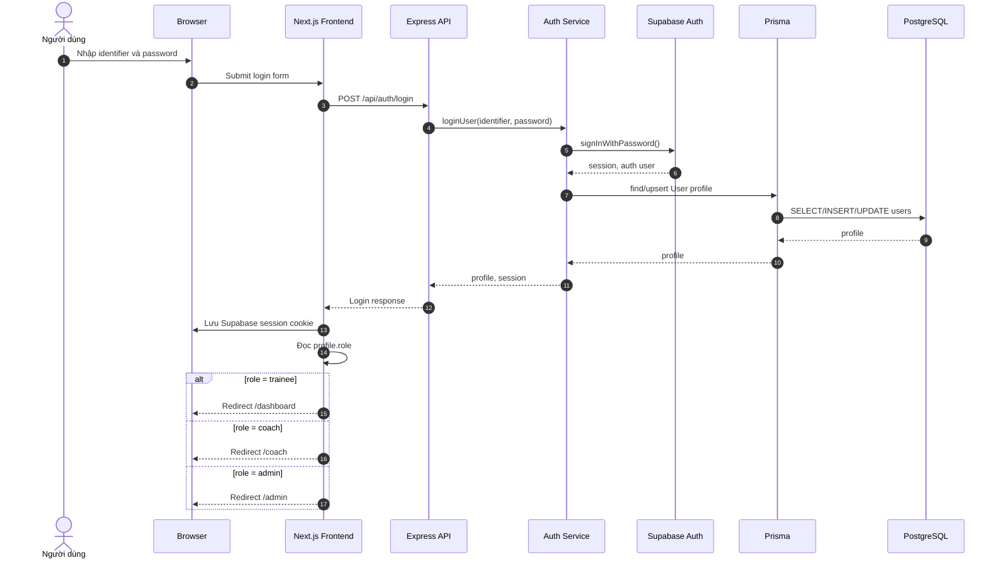
```mermaid
sequenceDiagram
  autonumber
  actor User as Người dùng
  participant Browser as Browser
  participant Next as Next.js Frontend
  participant API as Express API
  participant AuthService as Auth Service
  participant SupabaseAuth as Supabase Auth
  participant Prisma as Prisma
  participant DB as PostgreSQL

  User->>Browser: Nhập identifier và password
  Browser->>Next: Submit login form
  Next->>API: POST /api/auth/login
  API->>AuthService: loginUser(identifier, password)
  AuthService->>SupabaseAuth: signInWithPassword()
  SupabaseAuth-->>AuthService: session, auth user
  AuthService->>Prisma: find/upsert User profile
  Prisma->>DB: SELECT/INSERT/UPDATE users
  DB-->>Prisma: profile
  Prisma-->>AuthService: profile
  AuthService-->>API: profile, session
  API-->>Next: Login response
  Next->>Browser: Lưu Supabase session cookie
  Next->>Next: Đọc profile.role
  alt role = trainee
    Next-->>Browser: Redirect /dashboard
  else role = coach
    Next-->>Browser: Redirect /coach
  else role = admin
    Next-->>Browser: Redirect /admin
  end
```

## 2. Đăng ký tài khoản

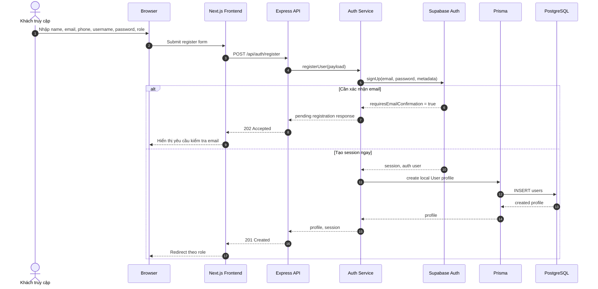
```mermaid
sequenceDiagram
  autonumber
  actor Visitor as Khách truy cập
  participant Browser as Browser
  participant Next as Next.js Frontend
  participant API as Express API
  participant AuthService as Auth Service
  participant SupabaseAuth as Supabase Auth
  participant Prisma as Prisma
  participant DB as PostgreSQL

  Visitor->>Browser: Nhập name, email, phone, username, password, role
  Browser->>Next: Submit register form
  Next->>API: POST /api/auth/register
  API->>AuthService: registerUser(payload)
  AuthService->>SupabaseAuth: signUp(email, password, metadata)
  alt Cần xác nhận email
    SupabaseAuth-->>AuthService: requiresEmailConfirmation = true
    AuthService-->>API: pending registration response
    API-->>Next: 202 Accepted
    Next-->>Browser: Hiển thị yêu cầu kiểm tra email
  else Tạo session ngay
    SupabaseAuth-->>AuthService: session, auth user
    AuthService->>Prisma: create local User profile
    Prisma->>DB: INSERT users
    DB-->>Prisma: created profile
    Prisma-->>AuthService: profile
    AuthService-->>API: profile, session
    API-->>Next: 201 Created
    Next-->>Browser: Redirect theo role
  end
```

## 3. Bảo vệ route và tải dashboard theo role

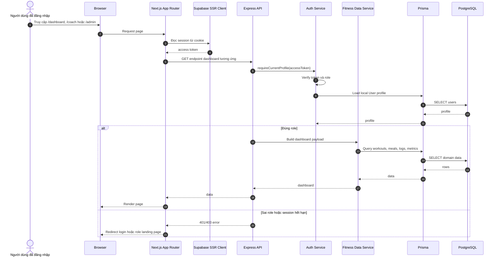
```mermaid
sequenceDiagram
  autonumber
  actor User as Người dùng đã đăng nhập
  participant Browser as Browser
  participant Next as Next.js App Router
  participant SupabaseSSR as Supabase SSR Client
  participant API as Express API
  participant AuthService as Auth Service
  participant FitnessService as Fitness Data Service
  participant Prisma as Prisma
  participant DB as PostgreSQL

  User->>Browser: Truy cập /dashboard, /coach hoặc /admin
  Browser->>Next: Request page
  Next->>SupabaseSSR: Đọc session từ cookie
  SupabaseSSR-->>Next: access token
  Next->>API: GET endpoint dashboard tương ứng
  API->>AuthService: requireCurrentProfile(accessToken)
  AuthService->>AuthService: Verify token và role
  AuthService->>Prisma: Load local User profile
  Prisma->>DB: SELECT users
  DB-->>Prisma: profile
  Prisma-->>AuthService: profile
  alt Đúng role
    API->>FitnessService: Build dashboard payload
    FitnessService->>Prisma: Query workouts, meals, logs, metrics
    Prisma->>DB: SELECT domain data
    DB-->>Prisma: rows
    Prisma-->>FitnessService: data
    FitnessService-->>API: dashboard
    API-->>Next: data
    Next-->>Browser: Render page
  else Sai role hoặc session hết hạn
    API-->>Next: 401/403 error
    Next-->>Browser: Redirect login hoặc role landing page
  end
```

## 4. Cập nhật profile và upload avatar

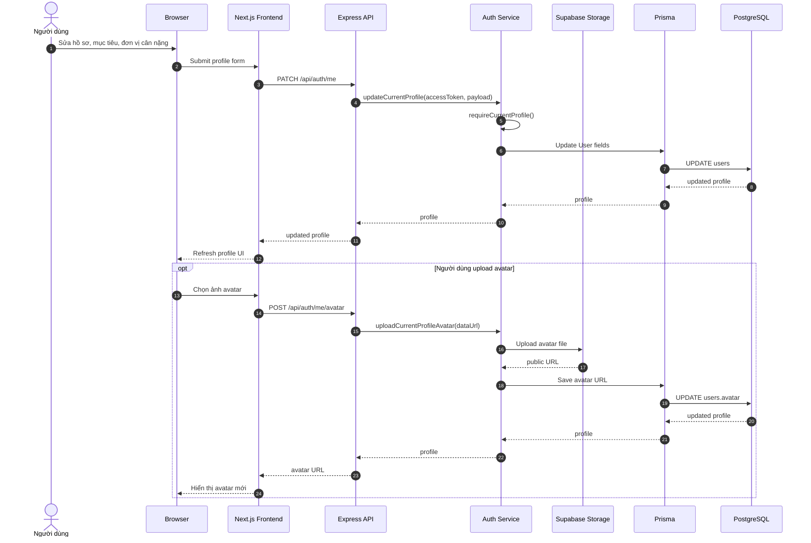
```mermaid
sequenceDiagram
  autonumber
  actor User as Người dùng
  participant Browser as Browser
  participant Next as Next.js Frontend
  participant API as Express API
  participant AuthService as Auth Service
  participant Storage as Supabase Storage
  participant Prisma as Prisma
  participant DB as PostgreSQL

  User->>Browser: Sửa hồ sơ, mục tiêu, đơn vị cân nặng
  Browser->>Next: Submit profile form
  Next->>API: PATCH /api/auth/me
  API->>AuthService: updateCurrentProfile(accessToken, payload)
  AuthService->>AuthService: requireCurrentProfile()
  AuthService->>Prisma: Update User fields
  Prisma->>DB: UPDATE users
  DB-->>Prisma: updated profile
  Prisma-->>AuthService: profile
  AuthService-->>API: profile
  API-->>Next: updated profile
  Next-->>Browser: Refresh profile UI

  opt Người dùng upload avatar
    Browser->>Next: Chọn ảnh avatar
    Next->>API: POST /api/auth/me/avatar
    API->>AuthService: uploadCurrentProfileAvatar(dataUrl)
    AuthService->>Storage: Upload avatar file
    Storage-->>AuthService: public URL
    AuthService->>Prisma: Save avatar URL
    Prisma->>DB: UPDATE users.avatar
    DB-->>Prisma: updated profile
    Prisma-->>AuthService: profile
    AuthService-->>API: profile
    API-->>Next: avatar URL
    Next-->>Browser: Hiển thị avatar mới
  end
```

## 5. Trainee tạo workout cá nhân

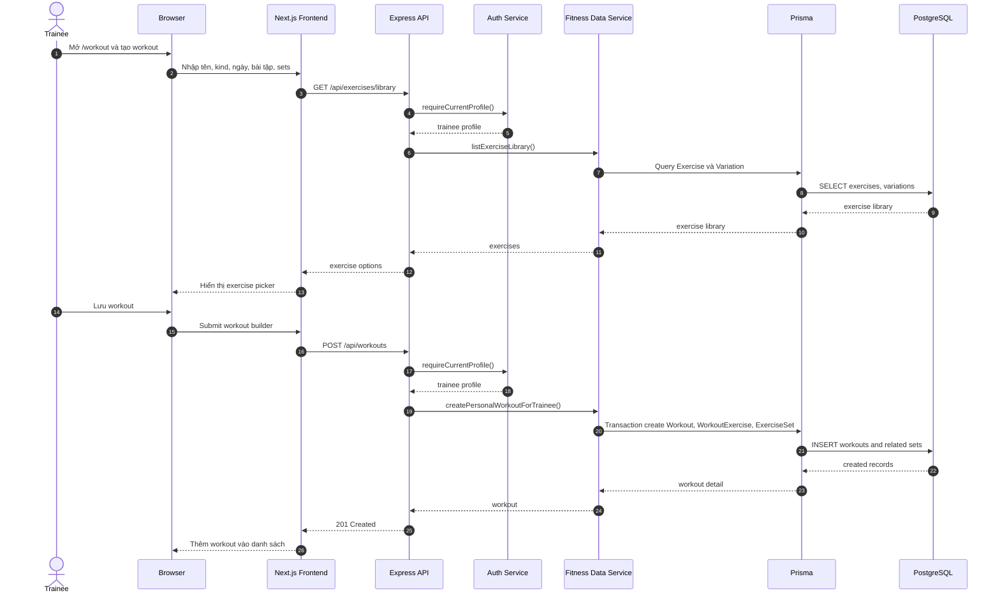
```mermaid
sequenceDiagram
  autonumber
  actor Trainee as Trainee
  participant Browser as Browser
  participant Next as Next.js Frontend
  participant API as Express API
  participant AuthService as Auth Service
  participant FitnessService as Fitness Data Service
  participant Prisma as Prisma
  participant DB as PostgreSQL

  Trainee->>Browser: Mở /workout và tạo workout
  Browser->>Next: Nhập tên, kind, ngày, bài tập, sets
  Next->>API: GET /api/exercises/library
  API->>AuthService: requireCurrentProfile()
  AuthService-->>API: trainee profile
  API->>FitnessService: listExerciseLibrary()
  FitnessService->>Prisma: Query Exercise và Variation
  Prisma->>DB: SELECT exercises, variations
  DB-->>Prisma: exercise library
  Prisma-->>FitnessService: exercise library
  FitnessService-->>API: exercises
  API-->>Next: exercise options
  Next-->>Browser: Hiển thị exercise picker

  Trainee->>Browser: Lưu workout
  Browser->>Next: Submit workout builder
  Next->>API: POST /api/workouts
  API->>AuthService: requireCurrentProfile()
  AuthService-->>API: trainee profile
  API->>FitnessService: createPersonalWorkoutForTrainee()
  FitnessService->>Prisma: Transaction create Workout, WorkoutExercise, ExerciseSet
  Prisma->>DB: INSERT workouts and related sets
  DB-->>Prisma: created records
  Prisma-->>FitnessService: workout detail
  FitnessService-->>API: workout
  API-->>Next: 201 Created
  Next-->>Browser: Thêm workout vào danh sách
```

## 6. Trainee bắt đầu và hoàn tất buổi tập

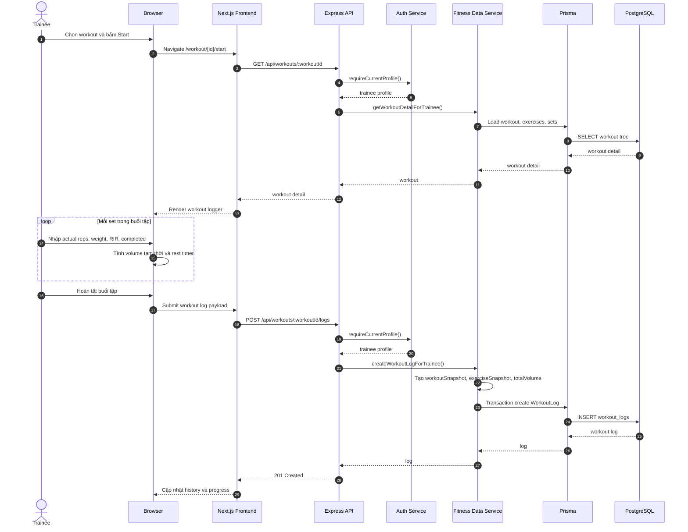
```mermaid
sequenceDiagram
  autonumber
  actor Trainee as Trainee
  participant Browser as Browser
  participant Next as Next.js Frontend
  participant API as Express API
  participant AuthService as Auth Service
  participant FitnessService as Fitness Data Service
  participant Prisma as Prisma
  participant DB as PostgreSQL

  Trainee->>Browser: Chọn workout và bấm Start
  Browser->>Next: Navigate /workout/[id]/start
  Next->>API: GET /api/workouts/:workoutId
  API->>AuthService: requireCurrentProfile()
  AuthService-->>API: trainee profile
  API->>FitnessService: getWorkoutDetailForTrainee()
  FitnessService->>Prisma: Load workout, exercises, sets
  Prisma->>DB: SELECT workout tree
  DB-->>Prisma: workout detail
  Prisma-->>FitnessService: workout detail
  FitnessService-->>API: workout
  API-->>Next: workout detail
  Next-->>Browser: Render workout logger

  loop Mỗi set trong buổi tập
    Trainee->>Browser: Nhập actual reps, weight, RIR, completed
    Browser->>Browser: Tính volume tạm thời và rest timer
  end

  Trainee->>Browser: Hoàn tất buổi tập
  Browser->>Next: Submit workout log payload
  Next->>API: POST /api/workouts/:workoutId/logs
  API->>AuthService: requireCurrentProfile()
  AuthService-->>API: trainee profile
  API->>FitnessService: createWorkoutLogForTrainee()
  FitnessService->>FitnessService: Tạo workoutSnapshot, exerciseSnapshot, totalVolume
  FitnessService->>Prisma: Transaction create WorkoutLog
  Prisma->>DB: INSERT workout_logs
  DB-->>Prisma: workout log
  Prisma-->>FitnessService: log
  FitnessService-->>API: log
  API-->>Next: 201 Created
  Next-->>Browser: Cập nhật history và progress
```

## 7. Trainee log meal item và tính macro ngày

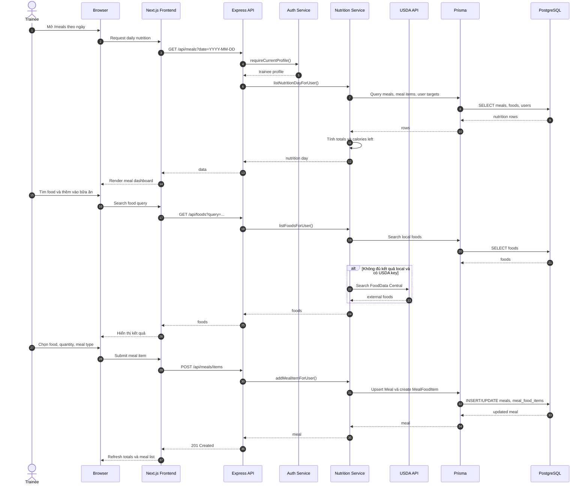
```mermaid
sequenceDiagram
  autonumber
  actor Trainee as Trainee
  participant Browser as Browser
  participant Next as Next.js Frontend
  participant API as Express API
  participant AuthService as Auth Service
  participant NutritionService as Nutrition Service
  participant USDA as USDA API
  participant Prisma as Prisma
  participant DB as PostgreSQL

  Trainee->>Browser: Mở /meals theo ngày
  Browser->>Next: Request daily nutrition
  Next->>API: GET /api/meals?date=YYYY-MM-DD
  API->>AuthService: requireCurrentProfile()
  AuthService-->>API: trainee profile
  API->>NutritionService: listNutritionDayForUser()
  NutritionService->>Prisma: Query meals, meal items, user targets
  Prisma->>DB: SELECT meals, foods, users
  DB-->>Prisma: nutrition rows
  Prisma-->>NutritionService: rows
  NutritionService->>NutritionService: Tính totals và calories left
  NutritionService-->>API: nutrition day
  API-->>Next: data
  Next-->>Browser: Render meal dashboard

  Trainee->>Browser: Tìm food và thêm vào bữa ăn
  Browser->>Next: Search food query
  Next->>API: GET /api/foods?query=...
  API->>NutritionService: listFoodsForUser()
  NutritionService->>Prisma: Search local foods
  Prisma->>DB: SELECT foods
  DB-->>Prisma: foods
  alt Không đủ kết quả local và có USDA key
    NutritionService->>USDA: Search FoodData Central
    USDA-->>NutritionService: external foods
  end
  NutritionService-->>API: foods
  API-->>Next: foods
  Next-->>Browser: Hiển thị kết quả

  Trainee->>Browser: Chọn food, quantity, meal type
  Browser->>Next: Submit meal item
  Next->>API: POST /api/meals/items
  API->>NutritionService: addMealItemForUser()
  NutritionService->>Prisma: Upsert Meal và create MealFoodItem
  Prisma->>DB: INSERT/UPDATE meals, meal_food_items
  DB-->>Prisma: updated meal
  Prisma-->>NutritionService: meal
  NutritionService-->>API: meal
  API-->>Next: 201 Created
  Next-->>Browser: Refresh totals và meal list
```

## 8. Trainee ghi cân nặng và xem progress analytics

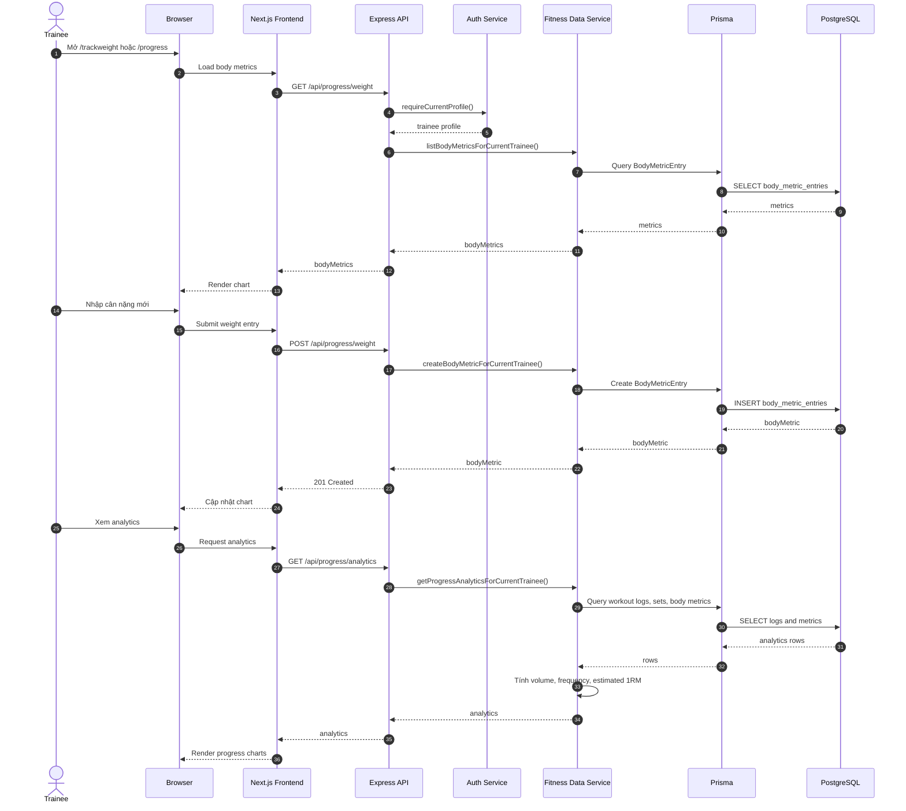
```mermaid
sequenceDiagram
  autonumber
  actor Trainee as Trainee
  participant Browser as Browser
  participant Next as Next.js Frontend
  participant API as Express API
  participant AuthService as Auth Service
  participant FitnessService as Fitness Data Service
  participant Prisma as Prisma
  participant DB as PostgreSQL

  Trainee->>Browser: Mở /trackweight hoặc /progress
  Browser->>Next: Load body metrics
  Next->>API: GET /api/progress/weight
  API->>AuthService: requireCurrentProfile()
  AuthService-->>API: trainee profile
  API->>FitnessService: listBodyMetricsForCurrentTrainee()
  FitnessService->>Prisma: Query BodyMetricEntry
  Prisma->>DB: SELECT body_metric_entries
  DB-->>Prisma: metrics
  Prisma-->>FitnessService: metrics
  FitnessService-->>API: bodyMetrics
  API-->>Next: bodyMetrics
  Next-->>Browser: Render chart

  Trainee->>Browser: Nhập cân nặng mới
  Browser->>Next: Submit weight entry
  Next->>API: POST /api/progress/weight
  API->>FitnessService: createBodyMetricForCurrentTrainee()
  FitnessService->>Prisma: Create BodyMetricEntry
  Prisma->>DB: INSERT body_metric_entries
  DB-->>Prisma: bodyMetric
  Prisma-->>FitnessService: bodyMetric
  FitnessService-->>API: bodyMetric
  API-->>Next: 201 Created
  Next-->>Browser: Cập nhật chart

  Trainee->>Browser: Xem analytics
  Browser->>Next: Request analytics
  Next->>API: GET /api/progress/analytics
  API->>FitnessService: getProgressAnalyticsForCurrentTrainee()
  FitnessService->>Prisma: Query workout logs, sets, body metrics
  Prisma->>DB: SELECT logs and metrics
  DB-->>Prisma: analytics rows
  Prisma-->>FitnessService: rows
  FitnessService->>FitnessService: Tính volume, frequency, estimated 1RM
  FitnessService-->>API: analytics
  API-->>Next: analytics
  Next-->>Browser: Render progress charts
```

## 9. Trainee tìm coach và coach duyệt yêu cầu

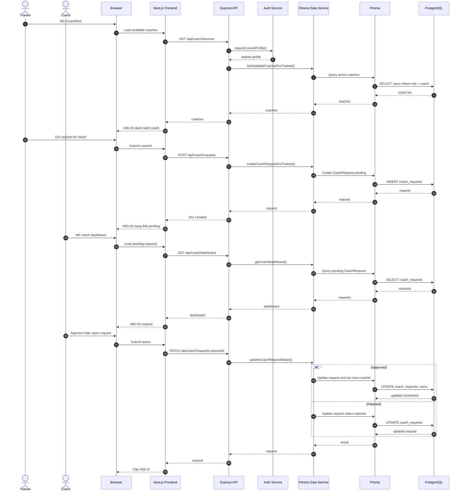
```mermaid
sequenceDiagram
  autonumber
  actor Trainee as Trainee
  actor Coach as Coach
  participant Browser as Browser
  participant Next as Next.js Frontend
  participant API as Express API
  participant AuthService as Auth Service
  participant FitnessService as Fitness Data Service
  participant Prisma as Prisma
  participant DB as PostgreSQL

  Trainee->>Browser: Mở /coach/find
  Browser->>Next: Load available coaches
  Next->>API: GET /api/coach/discover
  API->>AuthService: requireCurrentProfile()
  AuthService-->>API: trainee profile
  API->>FitnessService: listAvailableCoachesForTrainee()
  FitnessService->>Prisma: Query active coaches
  Prisma->>DB: SELECT users where role = coach
  DB-->>Prisma: coach list
  Prisma-->>FitnessService: coaches
  FitnessService-->>API: coaches
  API-->>Next: coaches
  Next-->>Browser: Hiển thị danh sách coach

  Trainee->>Browser: Gửi request tới coach
  Browser->>Next: Submit coachId
  Next->>API: POST /api/coach/requests
  API->>FitnessService: createCoachRequestForTrainee()
  FitnessService->>Prisma: Create CoachRequest pending
  Prisma->>DB: INSERT coach_requests
  DB-->>Prisma: request
  Prisma-->>FitnessService: request
  FitnessService-->>API: request
  API-->>Next: 201 Created
  Next-->>Browser: Hiển thị trạng thái pending

  Coach->>Browser: Mở coach dashboard
  Browser->>Next: Load pending requests
  Next->>API: GET /api/coach/dashboard
  API->>FitnessService: getCoachDashboard()
  FitnessService->>Prisma: Query pending CoachRequest
  Prisma->>DB: SELECT coach_requests
  DB-->>Prisma: requests
  Prisma-->>FitnessService: requests
  FitnessService-->>API: dashboard
  API-->>Next: dashboard
  Next-->>Browser: Hiển thị request

  Coach->>Browser: Approve hoặc reject request
  Browser->>Next: Submit status
  Next->>API: PATCH /api/coach/requests/:requestId
  API->>FitnessService: updateCoachRequestStatus()
  alt Approved
    FitnessService->>Prisma: Update request and set User.coachId
    Prisma->>DB: UPDATE coach_requests, users
    DB-->>Prisma: updated connection
  else Rejected
    FitnessService->>Prisma: Update request status rejected
    Prisma->>DB: UPDATE coach_requests
    DB-->>Prisma: updated request
  end
  Prisma-->>FitnessService: result
  FitnessService-->>API: request
  API-->>Next: request
  Next-->>Browser: Cập nhật UI
```

## 10. Coach tạo giáo án và gán cho trainee

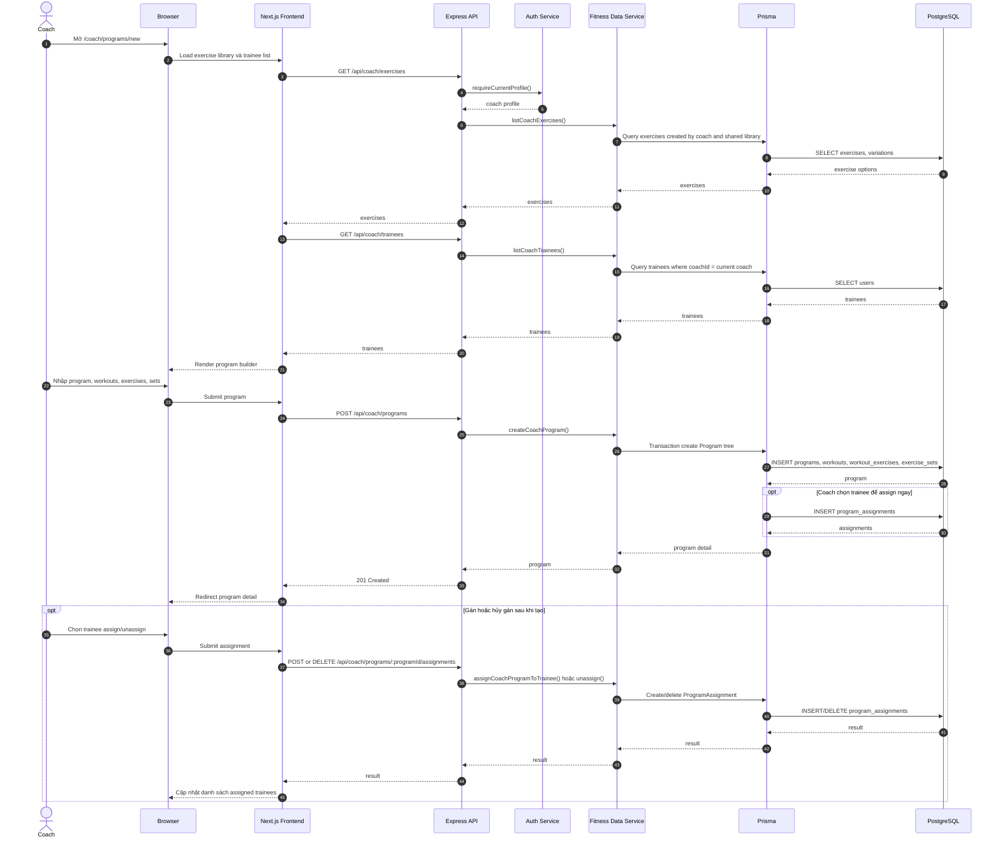
```mermaid
sequenceDiagram
  autonumber
  actor Coach as Coach
  participant Browser as Browser
  participant Next as Next.js Frontend
  participant API as Express API
  participant AuthService as Auth Service
  participant FitnessService as Fitness Data Service
  participant Prisma as Prisma
  participant DB as PostgreSQL

  Coach->>Browser: Mở /coach/programs/new
  Browser->>Next: Load exercise library và trainee list
  Next->>API: GET /api/coach/exercises
  API->>AuthService: requireCurrentProfile()
  AuthService-->>API: coach profile
  API->>FitnessService: listCoachExercises()
  FitnessService->>Prisma: Query exercises created by coach and shared library
  Prisma->>DB: SELECT exercises, variations
  DB-->>Prisma: exercise options
  Prisma-->>FitnessService: exercises
  FitnessService-->>API: exercises
  API-->>Next: exercises
  Next->>API: GET /api/coach/trainees
  API->>FitnessService: listCoachTrainees()
  FitnessService->>Prisma: Query trainees where coachId = current coach
  Prisma->>DB: SELECT users
  DB-->>Prisma: trainees
  Prisma-->>FitnessService: trainees
  FitnessService-->>API: trainees
  API-->>Next: trainees
  Next-->>Browser: Render program builder

  Coach->>Browser: Nhập program, workouts, exercises, sets
  Browser->>Next: Submit program
  Next->>API: POST /api/coach/programs
  API->>FitnessService: createCoachProgram()
  FitnessService->>Prisma: Transaction create Program tree
  Prisma->>DB: INSERT programs, workouts, workout_exercises, exercise_sets
  DB-->>Prisma: program
  opt Coach chọn trainee để assign ngay
    Prisma->>DB: INSERT program_assignments
    DB-->>Prisma: assignments
  end
  Prisma-->>FitnessService: program detail
  FitnessService-->>API: program
  API-->>Next: 201 Created
  Next-->>Browser: Redirect program detail

  opt Gán hoặc hủy gán sau khi tạo
    Coach->>Browser: Chọn trainee assign/unassign
    Browser->>Next: Submit assignment
    Next->>API: POST or DELETE /api/coach/programs/:programId/assignments
    API->>FitnessService: assignCoachProgramToTrainee() hoặc unassign()
    FitnessService->>Prisma: Create/delete ProgramAssignment
    Prisma->>DB: INSERT/DELETE program_assignments
    DB-->>Prisma: result
    Prisma-->>FitnessService: result
    FitnessService-->>API: result
    API-->>Next: result
    Next-->>Browser: Cập nhật danh sách assigned trainees
  end
```

## 11. Coach theo dõi trainee, comment log, check-in và export

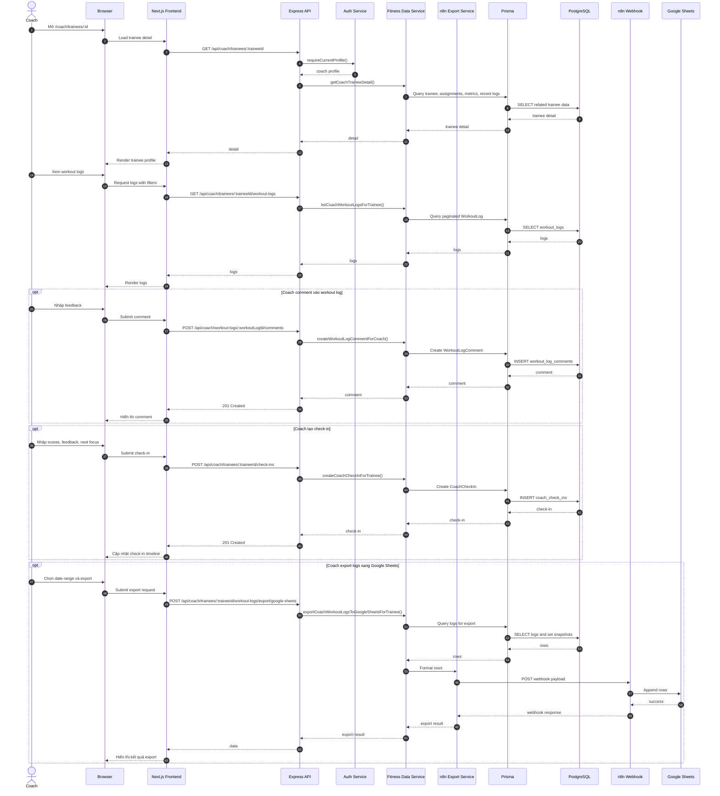
```mermaid
sequenceDiagram
  autonumber
  actor Coach as Coach
  participant Browser as Browser
  participant Next as Next.js Frontend
  participant API as Express API
  participant AuthService as Auth Service
  participant FitnessService as Fitness Data Service
  participant ExportService as n8n Export Service
  participant Prisma as Prisma
  participant DB as PostgreSQL
  participant N8N as n8n Webhook
  participant Sheets as Google Sheets

  Coach->>Browser: Mở /coach/trainees/:id
  Browser->>Next: Load trainee detail
  Next->>API: GET /api/coach/trainees/:traineeId
  API->>AuthService: requireCurrentProfile()
  AuthService-->>API: coach profile
  API->>FitnessService: getCoachTraineeDetail()
  FitnessService->>Prisma: Query trainee, assignments, metrics, recent logs
  Prisma->>DB: SELECT related trainee data
  DB-->>Prisma: trainee detail
  Prisma-->>FitnessService: trainee detail
  FitnessService-->>API: detail
  API-->>Next: detail
  Next-->>Browser: Render trainee profile

  Coach->>Browser: Xem workout logs
  Browser->>Next: Request logs with filters
  Next->>API: GET /api/coach/trainees/:traineeId/workout-logs
  API->>FitnessService: listCoachWorkoutLogsForTrainee()
  FitnessService->>Prisma: Query paginated WorkoutLog
  Prisma->>DB: SELECT workout_logs
  DB-->>Prisma: logs
  Prisma-->>FitnessService: logs
  FitnessService-->>API: logs
  API-->>Next: logs
  Next-->>Browser: Render logs

  opt Coach comment vào workout log
    Coach->>Browser: Nhập feedback
    Browser->>Next: Submit comment
    Next->>API: POST /api/coach/workout-logs/:workoutLogId/comments
    API->>FitnessService: createWorkoutLogCommentForCoach()
    FitnessService->>Prisma: Create WorkoutLogComment
    Prisma->>DB: INSERT workout_log_comments
    DB-->>Prisma: comment
    Prisma-->>FitnessService: comment
    FitnessService-->>API: comment
    API-->>Next: 201 Created
    Next-->>Browser: Hiển thị comment
  end

  opt Coach tạo check-in
    Coach->>Browser: Nhập scores, feedback, next focus
    Browser->>Next: Submit check-in
    Next->>API: POST /api/coach/trainees/:traineeId/check-ins
    API->>FitnessService: createCoachCheckInForTrainee()
    FitnessService->>Prisma: Create CoachCheckIn
    Prisma->>DB: INSERT coach_check_ins
    DB-->>Prisma: check-in
    Prisma-->>FitnessService: check-in
    FitnessService-->>API: check-in
    API-->>Next: 201 Created
    Next-->>Browser: Cập nhật check-in timeline
  end

  opt Coach export logs sang Google Sheets
    Coach->>Browser: Chọn date range và export
    Browser->>Next: Submit export request
    Next->>API: POST /api/coach/trainees/:traineeId/workout-logs/export/google-sheets
    API->>FitnessService: exportCoachWorkoutLogsToGoogleSheetsForTrainee()
    FitnessService->>Prisma: Query logs for export
    Prisma->>DB: SELECT logs and set snapshots
    DB-->>Prisma: rows
    Prisma-->>FitnessService: rows
    FitnessService->>ExportService: Format rows
    ExportService->>N8N: POST webhook payload
    N8N->>Sheets: Append rows
    Sheets-->>N8N: success
    N8N-->>ExportService: webhook response
    ExportService-->>FitnessService: export result
    FitnessService-->>API: export result
    API-->>Next: data
    Next-->>Browser: Hiển thị kết quả export
  end
```

## 12. Admin quản lý user và kết nối coach - trainee

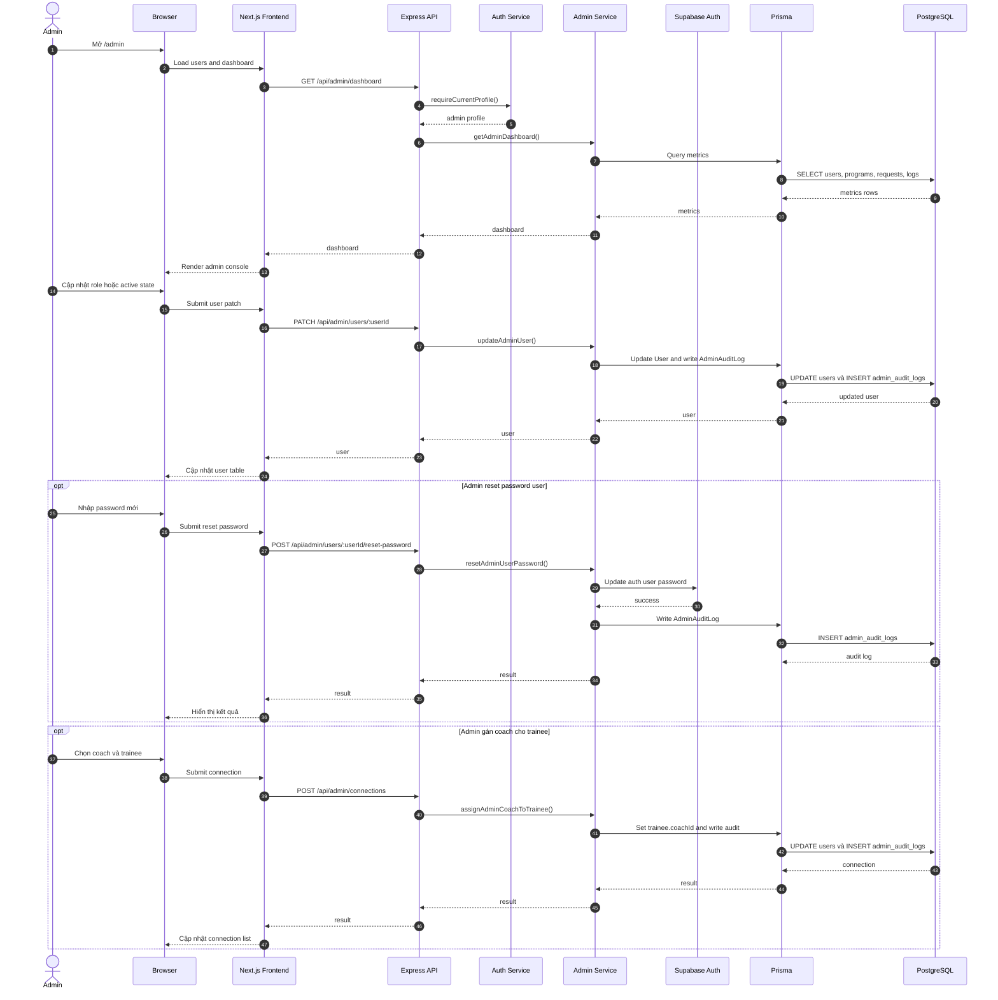
```mermaid
sequenceDiagram
  autonumber
  actor Admin as Admin
  participant Browser as Browser
  participant Next as Next.js Frontend
  participant API as Express API
  participant AuthService as Auth Service
  participant AdminService as Admin Service
  participant SupabaseAuth as Supabase Auth
  participant Prisma as Prisma
  participant DB as PostgreSQL

  Admin->>Browser: Mở /admin
  Browser->>Next: Load users and dashboard
  Next->>API: GET /api/admin/dashboard
  API->>AuthService: requireCurrentProfile()
  AuthService-->>API: admin profile
  API->>AdminService: getAdminDashboard()
  AdminService->>Prisma: Query metrics
  Prisma->>DB: SELECT users, programs, requests, logs
  DB-->>Prisma: metrics rows
  Prisma-->>AdminService: metrics
  AdminService-->>API: dashboard
  API-->>Next: dashboard
  Next-->>Browser: Render admin console

  Admin->>Browser: Cập nhật role hoặc active state
  Browser->>Next: Submit user patch
  Next->>API: PATCH /api/admin/users/:userId
  API->>AdminService: updateAdminUser()
  AdminService->>Prisma: Update User and write AdminAuditLog
  Prisma->>DB: UPDATE users và INSERT admin_audit_logs
  DB-->>Prisma: updated user
  Prisma-->>AdminService: user
  AdminService-->>API: user
  API-->>Next: user
  Next-->>Browser: Cập nhật user table

  opt Admin reset password user
    Admin->>Browser: Nhập password mới
    Browser->>Next: Submit reset password
    Next->>API: POST /api/admin/users/:userId/reset-password
    API->>AdminService: resetAdminUserPassword()
    AdminService->>SupabaseAuth: Update auth user password
    SupabaseAuth-->>AdminService: success
    AdminService->>Prisma: Write AdminAuditLog
    Prisma->>DB: INSERT admin_audit_logs
    DB-->>Prisma: audit log
    AdminService-->>API: result
    API-->>Next: result
    Next-->>Browser: Hiển thị kết quả
  end

  opt Admin gán coach cho trainee
    Admin->>Browser: Chọn coach và trainee
    Browser->>Next: Submit connection
    Next->>API: POST /api/admin/connections
    API->>AdminService: assignAdminCoachToTrainee()
    AdminService->>Prisma: Set trainee.coachId and write audit
    Prisma->>DB: UPDATE users và INSERT admin_audit_logs
    DB-->>Prisma: connection
    Prisma-->>AdminService: result
    AdminService-->>API: result
    API-->>Next: result
    Next-->>Browser: Cập nhật connection list
  end
```

## 13. Admin duyệt import exercise từ coach

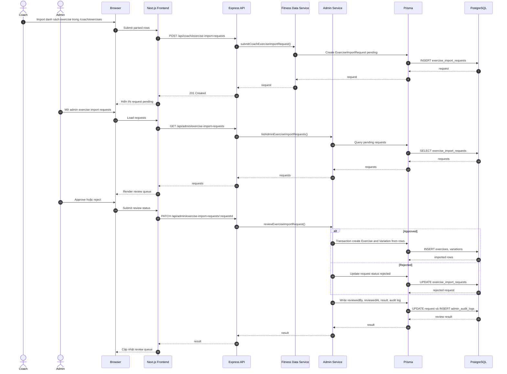
```mermaid
sequenceDiagram
  autonumber
  actor Coach as Coach
  actor Admin as Admin
  participant Browser as Browser
  participant Next as Next.js Frontend
  participant API as Express API
  participant FitnessService as Fitness Data Service
  participant AdminService as Admin Service
  participant Prisma as Prisma
  participant DB as PostgreSQL

  Coach->>Browser: Import danh sách exercise trong /coach/exercises
  Browser->>Next: Submit parsed rows
  Next->>API: POST /api/coach/exercise-import-requests
  API->>FitnessService: submitCoachExerciseImportRequest()
  FitnessService->>Prisma: Create ExerciseImportRequest pending
  Prisma->>DB: INSERT exercise_import_requests
  DB-->>Prisma: request
  Prisma-->>FitnessService: request
  FitnessService-->>API: request
  API-->>Next: 201 Created
  Next-->>Browser: Hiển thị request pending

  Admin->>Browser: Mở admin exercise import requests
  Browser->>Next: Load requests
  Next->>API: GET /api/admin/exercise-import-requests
  API->>AdminService: listAdminExerciseImportRequests()
  AdminService->>Prisma: Query pending requests
  Prisma->>DB: SELECT exercise_import_requests
  DB-->>Prisma: requests
  Prisma-->>AdminService: requests
  AdminService-->>API: requests
  API-->>Next: requests
  Next-->>Browser: Render review queue

  Admin->>Browser: Approve hoặc reject
  Browser->>Next: Submit review status
  Next->>API: PATCH /api/admin/exercise-import-requests/:requestId
  API->>AdminService: reviewExerciseImportRequest()
  alt Approved
    AdminService->>Prisma: Transaction create Exercise and Variation from rows
    Prisma->>DB: INSERT exercises, variations
    DB-->>Prisma: imported rows
  else Rejected
    AdminService->>Prisma: Update request status rejected
    Prisma->>DB: UPDATE exercise_import_requests
    DB-->>Prisma: rejected request
  end
  AdminService->>Prisma: Write reviewedBy, reviewedAt, result, audit log
  Prisma->>DB: UPDATE request và INSERT admin_audit_logs
  DB-->>Prisma: review result
  Prisma-->>AdminService: result
  AdminService-->>API: result
  API-->>Next: result
  Next-->>Browser: Cập nhật review queue
```

## 14. AI generate và accept workout program

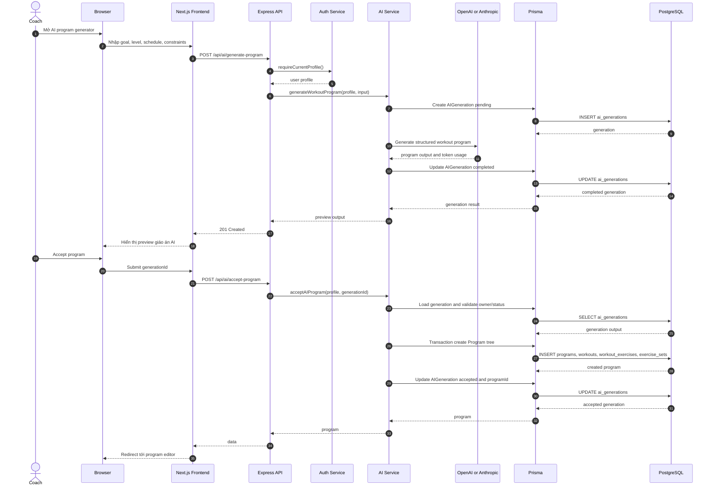
```mermaid
sequenceDiagram
  autonumber
  actor Coach as Coach
  participant Browser as Browser
  participant Next as Next.js Frontend
  participant API as Express API
  participant AuthService as Auth Service
  participant AIService as AI Service
  participant AIProvider as OpenAI or Anthropic
  participant Prisma as Prisma
  participant DB as PostgreSQL

  Coach->>Browser: Mở AI program generator
  Browser->>Next: Nhập goal, level, schedule, constraints
  Next->>API: POST /api/ai/generate-program
  API->>AuthService: requireCurrentProfile()
  AuthService-->>API: user profile
  API->>AIService: generateWorkoutProgram(profile, input)
  AIService->>Prisma: Create AIGeneration pending
  Prisma->>DB: INSERT ai_generations
  DB-->>Prisma: generation
  AIService->>AIProvider: Generate structured workout program
  AIProvider-->>AIService: program output and token usage
  AIService->>Prisma: Update AIGeneration completed
  Prisma->>DB: UPDATE ai_generations
  DB-->>Prisma: completed generation
  Prisma-->>AIService: generation result
  AIService-->>API: preview output
  API-->>Next: 201 Created
  Next-->>Browser: Hiển thị preview giáo án AI

  Coach->>Browser: Accept program
  Browser->>Next: Submit generationId
  Next->>API: POST /api/ai/accept-program
  API->>AIService: acceptAIProgram(profile, generationId)
  AIService->>Prisma: Load generation and validate owner/status
  Prisma->>DB: SELECT ai_generations
  DB-->>Prisma: generation output
  AIService->>Prisma: Transaction create Program tree
  Prisma->>DB: INSERT programs, workouts, workout_exercises, exercise_sets
  DB-->>Prisma: created program
  AIService->>Prisma: Update AIGeneration accepted and programId
  Prisma->>DB: UPDATE ai_generations
  DB-->>Prisma: accepted generation
  Prisma-->>AIService: program
  AIService-->>API: program
  API-->>Next: data
  Next-->>Browser: Redirect tới program editor
```

## 15. AI generate meal plan và accept vào meal log

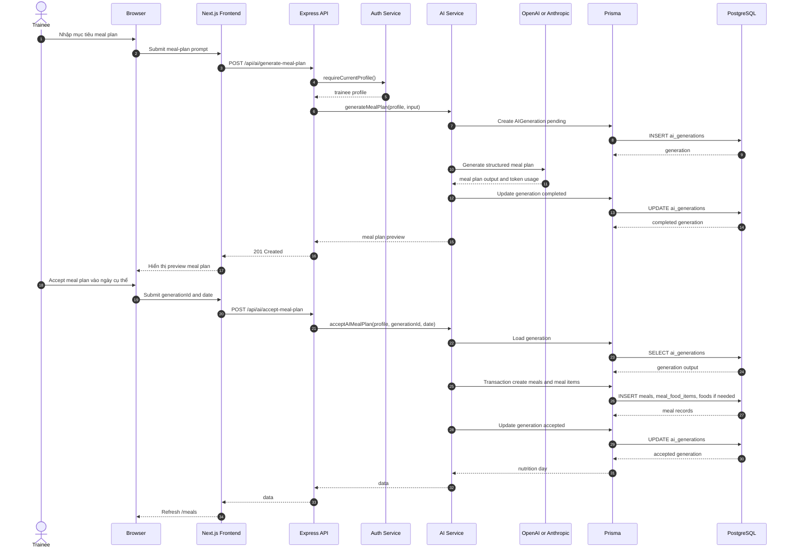
```mermaid
sequenceDiagram
  autonumber
  actor Trainee as Trainee
  participant Browser as Browser
  participant Next as Next.js Frontend
  participant API as Express API
  participant AuthService as Auth Service
  participant AIService as AI Service
  participant AIProvider as OpenAI or Anthropic
  participant Prisma as Prisma
  participant DB as PostgreSQL

  Trainee->>Browser: Nhập mục tiêu meal plan
  Browser->>Next: Submit meal-plan prompt
  Next->>API: POST /api/ai/generate-meal-plan
  API->>AuthService: requireCurrentProfile()
  AuthService-->>API: trainee profile
  API->>AIService: generateMealPlan(profile, input)
  AIService->>Prisma: Create AIGeneration pending
  Prisma->>DB: INSERT ai_generations
  DB-->>Prisma: generation
  AIService->>AIProvider: Generate structured meal plan
  AIProvider-->>AIService: meal plan output and token usage
  AIService->>Prisma: Update generation completed
  Prisma->>DB: UPDATE ai_generations
  DB-->>Prisma: completed generation
  AIService-->>API: meal plan preview
  API-->>Next: 201 Created
  Next-->>Browser: Hiển thị preview meal plan

  Trainee->>Browser: Accept meal plan vào ngày cụ thể
  Browser->>Next: Submit generationId and date
  Next->>API: POST /api/ai/accept-meal-plan
  API->>AIService: acceptAIMealPlan(profile, generationId, date)
  AIService->>Prisma: Load generation
  Prisma->>DB: SELECT ai_generations
  DB-->>Prisma: generation output
  AIService->>Prisma: Transaction create meals and meal items
  Prisma->>DB: INSERT meals, meal_food_items, foods if needed
  DB-->>Prisma: meal records
  AIService->>Prisma: Update generation accepted
  Prisma->>DB: UPDATE ai_generations
  DB-->>Prisma: accepted generation
  Prisma-->>AIService: nutrition day
  AIService-->>API: data
  API-->>Next: data
  Next-->>Browser: Refresh /meals
```

## 16. Notification: đọc và đánh dấu đã đọc

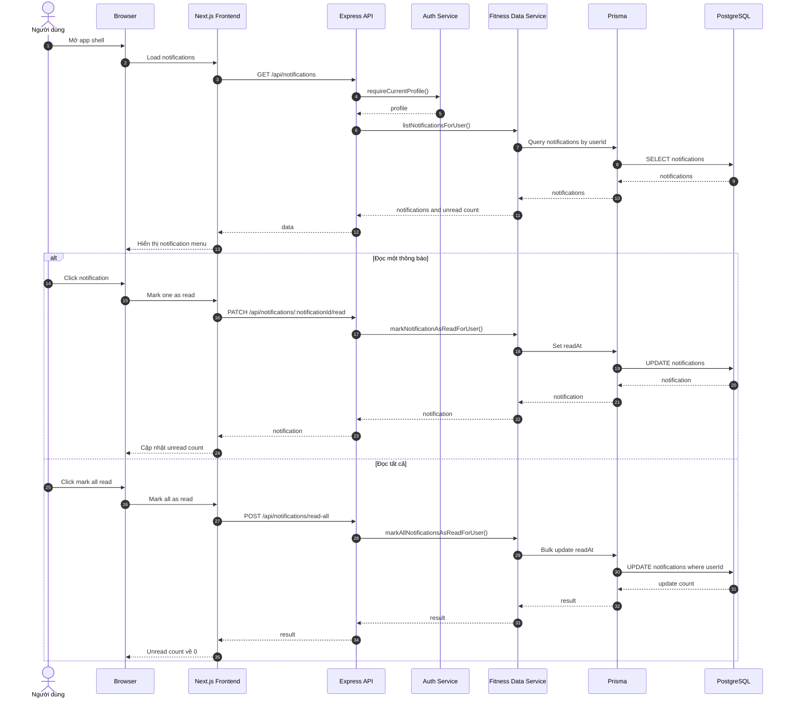
```mermaid
sequenceDiagram
  autonumber
  actor User as Người dùng
  participant Browser as Browser
  participant Next as Next.js Frontend
  participant API as Express API
  participant AuthService as Auth Service
  participant FitnessService as Fitness Data Service
  participant Prisma as Prisma
  participant DB as PostgreSQL

  User->>Browser: Mở app shell
  Browser->>Next: Load notifications
  Next->>API: GET /api/notifications
  API->>AuthService: requireCurrentProfile()
  AuthService-->>API: profile
  API->>FitnessService: listNotificationsForUser()
  FitnessService->>Prisma: Query notifications by userId
  Prisma->>DB: SELECT notifications
  DB-->>Prisma: notifications
  Prisma-->>FitnessService: notifications
  FitnessService-->>API: notifications and unread count
  API-->>Next: data
  Next-->>Browser: Hiển thị notification menu

  alt Đọc một thông báo
    User->>Browser: Click notification
    Browser->>Next: Mark one as read
    Next->>API: PATCH /api/notifications/:notificationId/read
    API->>FitnessService: markNotificationAsReadForUser()
    FitnessService->>Prisma: Set readAt
    Prisma->>DB: UPDATE notifications
    DB-->>Prisma: notification
    Prisma-->>FitnessService: notification
    FitnessService-->>API: notification
    API-->>Next: notification
    Next-->>Browser: Cập nhật unread count
  else Đọc tất cả
    User->>Browser: Click mark all read
    Browser->>Next: Mark all as read
    Next->>API: POST /api/notifications/read-all
    API->>FitnessService: markAllNotificationsAsReadForUser()
    FitnessService->>Prisma: Bulk update readAt
    Prisma->>DB: UPDATE notifications where userId
    DB-->>Prisma: update count
    Prisma-->>FitnessService: result
    FitnessService-->>API: result
    API-->>Next: result
    Next-->>Browser: Unread count về 0
  end
```
