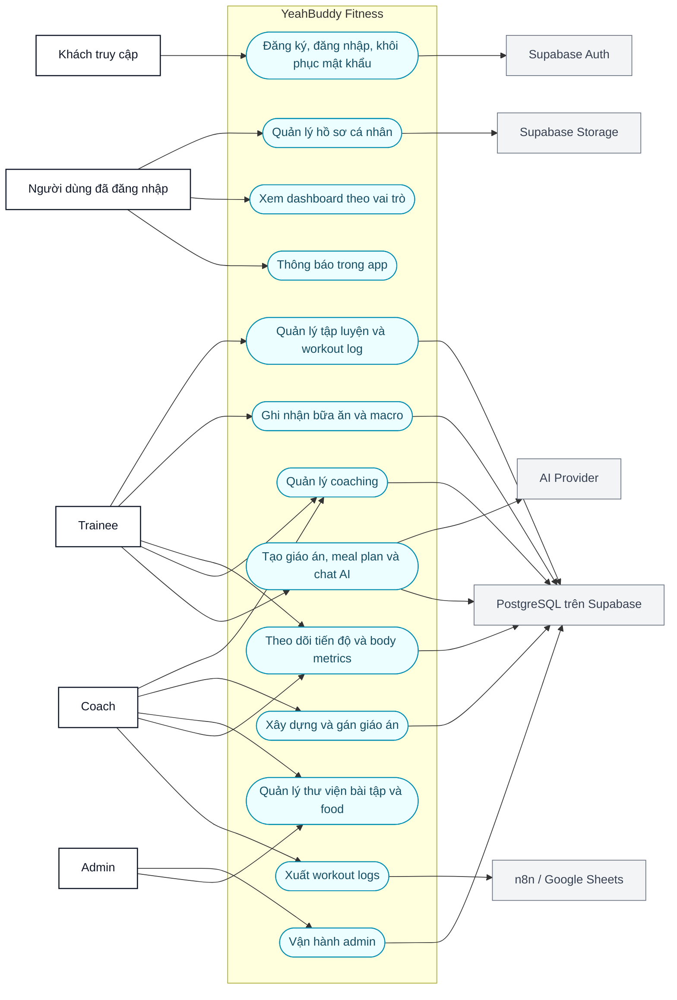
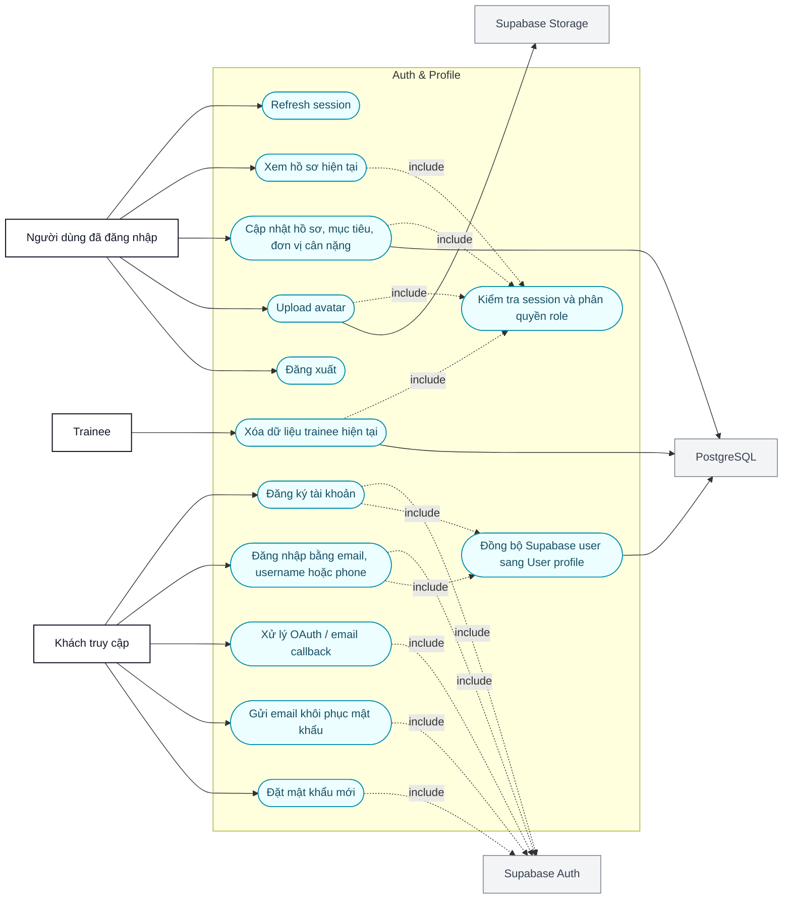
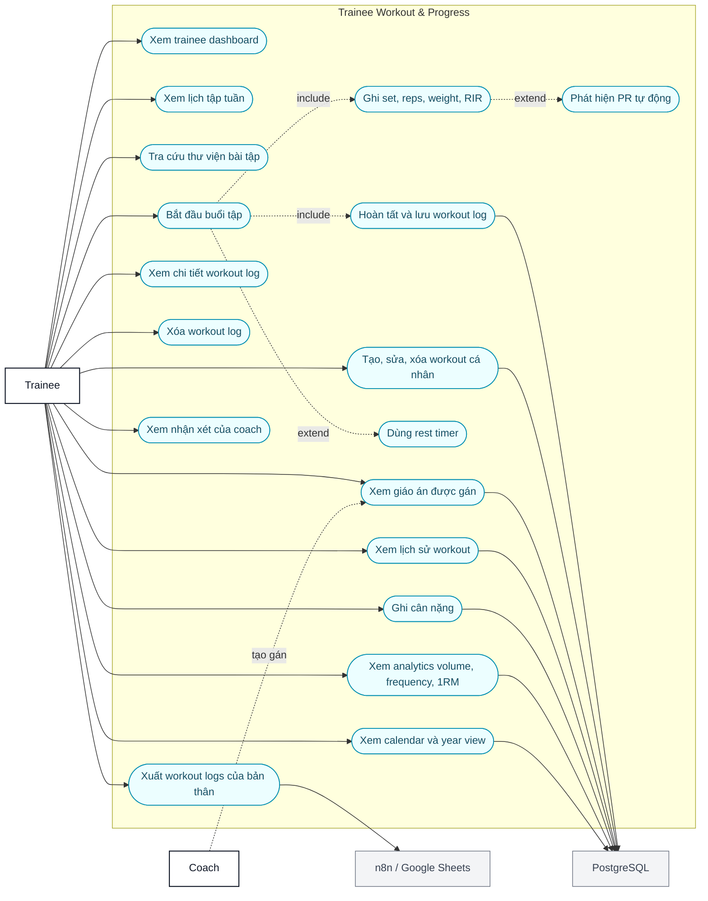
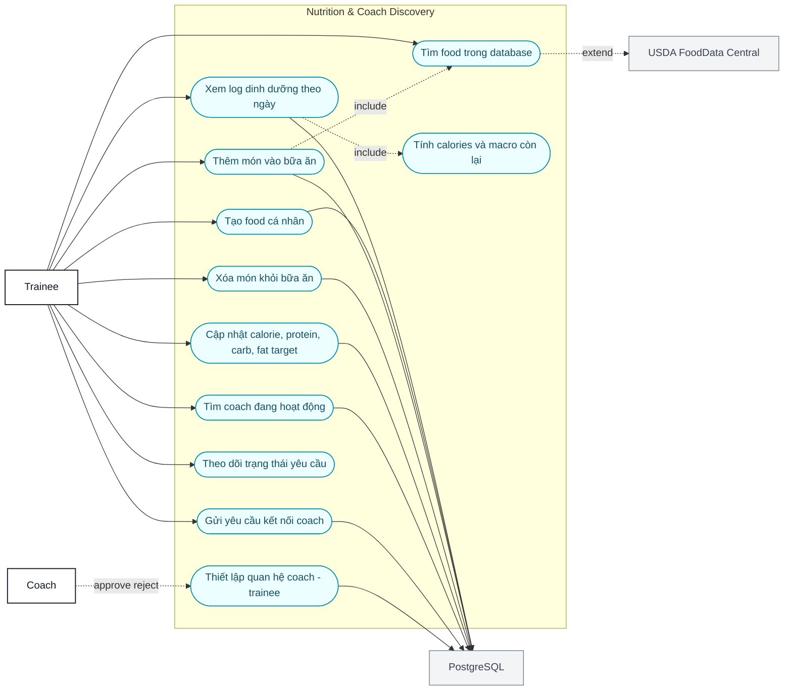
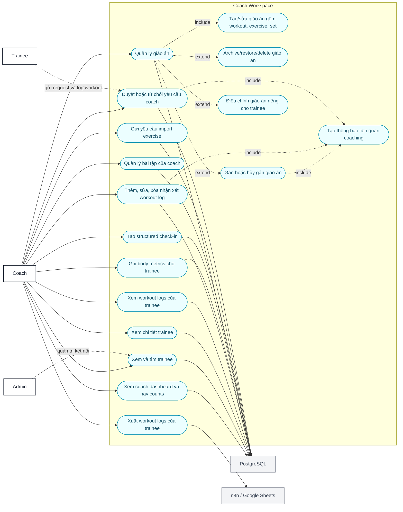
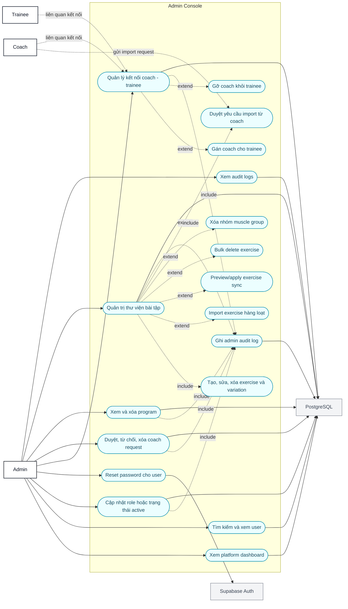
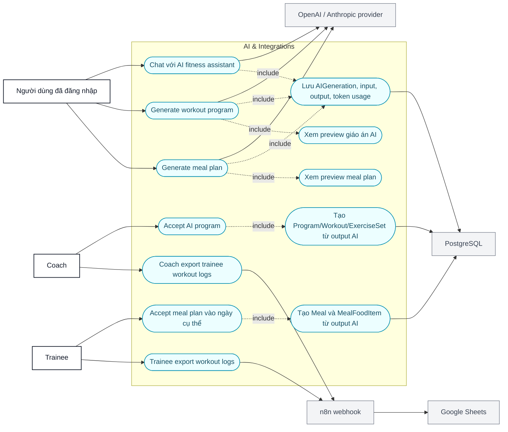
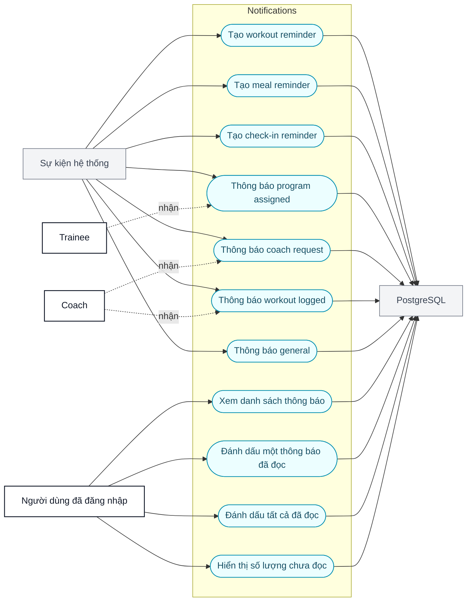

# Use Case Diagrams - YeahBuddy Fitness

Tài liệu này mô tả các use case chính của hệ thống YeahBuddy Fitness bằng Mermaid. Các sơ đồ được tách theo actor và domain để dễ render, dễ đưa vào báo cáo hoặc tài liệu phân tích thiết kế.

Nguồn đối chiếu: `README.md`, `backend/prisma/schema.prisma`, các route trong `backend/src/routes/*`.

Ghi chú: Mermaid không có cú pháp UML use case native ổn định trên mọi viewer, nên tài liệu dùng `flowchart LR` với use case dạng oval và actor dạng node riêng.

Quy ước đọc sơ đồ:

- Đường liền: actor trực tiếp thực hiện use case.
- Đường chấm `include`: use case luôn gọi thêm use case phụ.
- Đường chấm `extend`: use case mở rộng tùy điều kiện.
- Node màu xám: hệ thống/tích hợp bên ngoài.

## 1. Tổng quan hệ thống

## 2. Auth, session và profile

## 3. Trainee - tập luyện, lịch tập và tiến độ

## 4. Trainee - nutrition và tìm coach

## 5. Coach - coaching, giáo án và trainee management

## 6. Admin - vận hành nền tảng

## 7. AI assistant và tích hợp ngoài

## 8. Notification và reminder

