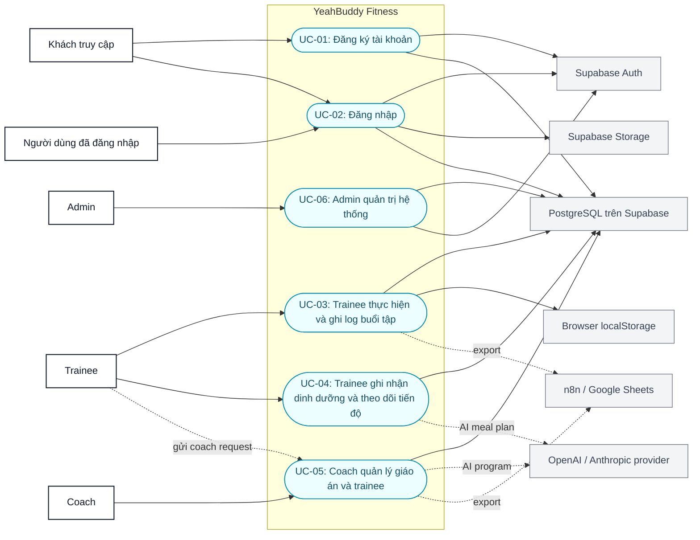
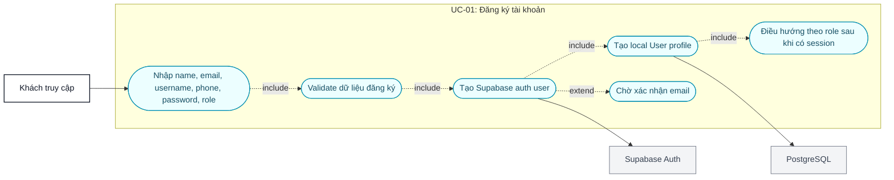
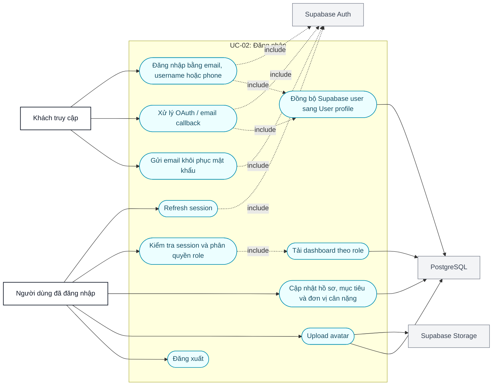
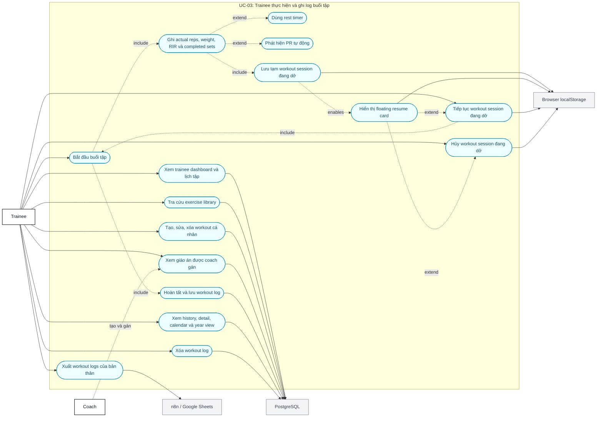
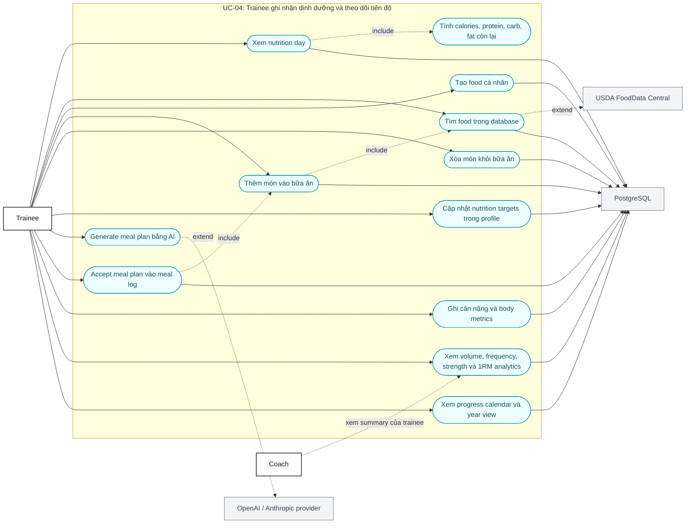
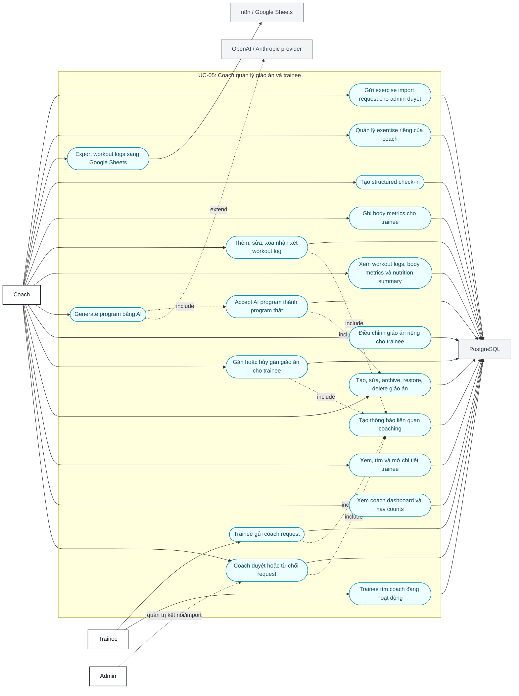
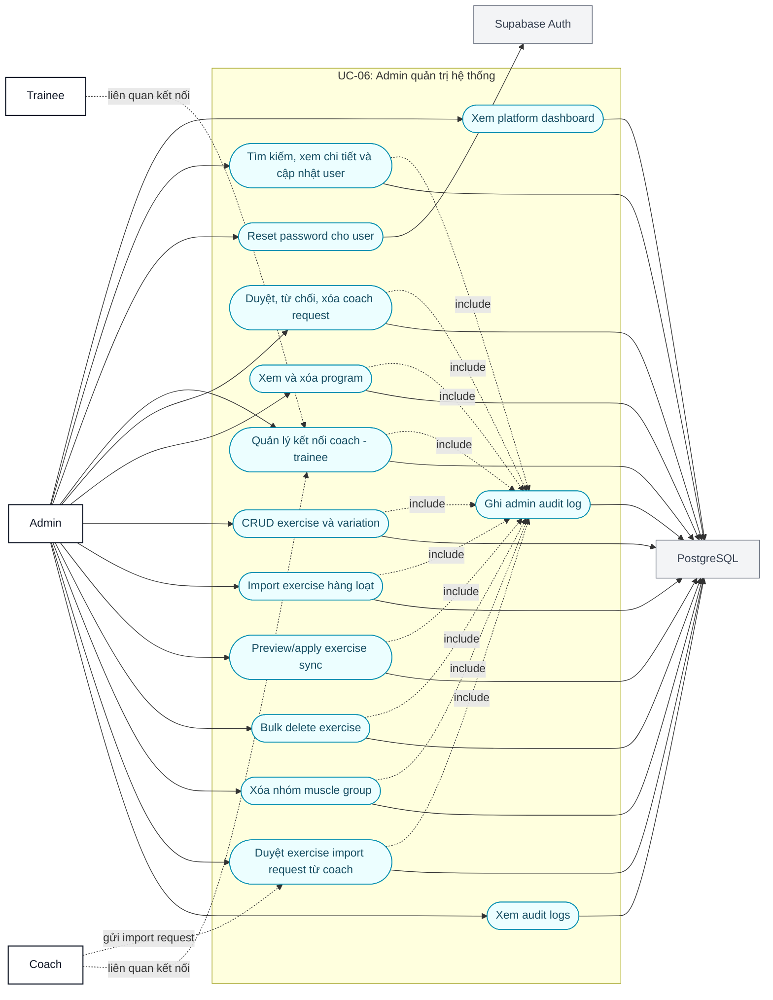

# Use Case Diagrams - YeahBuddy Fitness

Tài liệu này dùng 6 use case chính làm source of truth cho hệ thống YeahBuddy Fitness. Các chức năng như profile, avatar, resume workout, notification, AI, export và exercise import là luồng phụ hoặc supporting flow, không tách thành use case chính độc lập.

Nguồn đối chiếu: `README.md`, `backend/prisma/schema.prisma`, `backend/src/routes/*`, `lib/*/api.ts`.

Ghi chú: Mermaid không có cú pháp UML use case native ổn định trên mọi viewer, nên tài liệu dùng `flowchart LR` với use case dạng oval và actor dạng node riêng.

Quy ước đọc sơ đồ:

- Đường liền: actor trực tiếp thực hiện use case.
- Đường chấm `include`: use case chính luôn gọi thêm luồng con.
- Đường chấm `extend`: luồng mở rộng tùy điều kiện.
- Node màu xám: hệ thống/tích hợp bên ngoài.

## 1. Tổng quan 6 use case chính

## 2. UC-01 - Đăng ký tài khoản

## 3. UC-02 - Đăng nhập

## 4. UC-03 - Trainee thực hiện và ghi log buổi tập

## 5. UC-04 - Trainee ghi nhận dinh dưỡng và theo dõi tiến độ

## 6. UC-05 - Coach quản lý giáo án và trainee

## 7. UC-06 - Admin quản trị hệ thống

## 8. Mapping luồng phụ vào 6 UC chính

| Luồng/chức năng | Thuộc UC chính | Ghi chú |
|---|---|---|
| Profile, avatar, refresh session, forgot password, route guard | UC-02 | Là supporting flow sau đăng nhập hoặc trong auth/session. |
| Resume/discard workout session | UC-03 | Là extension của trainee đang thực hiện buổi tập, lưu bằng `localStorage`. |
| Export workout logs của trainee | UC-03 | Là extension sau khi đã có workout logs. |
| AI meal plan | UC-04 | Là extension của meal logging, khi accept sẽ tạo meal log. |
| Trainee tìm coach và gửi request | UC-05 | Là luồng mở đầu quan hệ coaching. |
| Coach request, comment, check-in, export | UC-05 | Là các flow trong quản lý trainee của coach. |
| AI workout program | UC-05 | Là extension của coach tạo giáo án. |
| Exercise import request từ coach | UC-05 -> UC-06 | Coach gửi request, admin review trong UC-06. |
| User/role/connection/audit/exercise import admin | UC-06 | Là các flow quản trị nền tảng. |
| Notification | UC-02/UC-03/UC-05 | Là supporting flow phát sinh từ auth, workout và coaching, không là UC chính riêng. |
